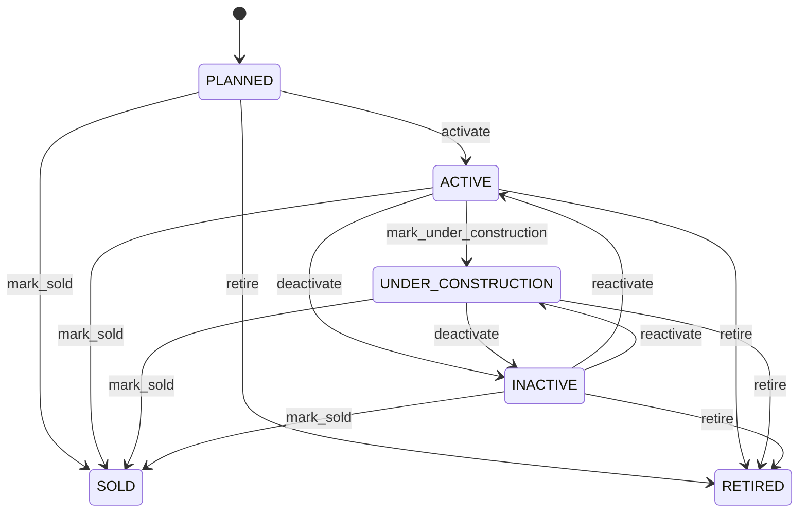

# Property

Represents a real estate entity called Property within the CEDM business model. Property is a business concept with its own identity and lifecycle. It captures information that must remain understandable independently of a database, API, or user interface. Used by business processes, transactions, forms, reports, integrations, and domain capabilities that create, find, change, or relate Property records. The entity participates in a wider business graph through relationships with Location, Party, Organization, Lease. These relationships provide the context needed to interpret the record rather than treating its fields as isolated database columns. The entity lifecycle is governed by its status, invariants, and related business processes. State changes must preserve the declared business meaning and relationships. A typical Property record represents one identifiable business occurrence or master-data object that can be referenced by related CEDM processes.

## Finding records

Open **Property** from the menu or from its card on the dashboard.

The list shows Property Code, Name, Property Type, Status, Location, Organization, with the most recently changed record first. The **Help** button beside the title opens this window's help text.

- **Search**: type in the search box above the grid to narrow the rows. **Search** at the top left opens advanced search, where you pick a field, a comparison (equals, contains, starts with, before, after, and so on) and a value.
- **Sort**: click a column heading; click again to reverse.
- **Refresh**: the refresh button at the top right re-reads the rows and every dropdown, so a record created a moment ago by someone else appears.
- **Export**: **CSV** downloads the rows you are looking at.
- **Open a record**: click a row. The line under the title, "Showing 1 to n of N entries", tells you how many rows match.

## Creating a record

Choose **New** at the top of the list. The form opens on its own page, with the fields in sections. A badge beside each label names the control (Text, Dropdown, Date, and so on); a red star marks a required field; the question-mark icon shows that field's help; and a hint such as “max 300” shows the longest entry accepted.

1. Fill in the fields described under [Fields](#fields).
2. These are required and must be completed before the record can be saved: **Property Code**, **Name**, **Property Type**, **Status**, **Location**.
3. For a dropdown that points at another window, pick the matching record; if the record you need does not exist yet, create it in its own window first. A dropdown may narrow to what you have already chosen, for example the states of the chosen country.
4. Choose **Create** (or **Save** in the toolbar). You return to the record, and it appears at the top of the list. If something is wrong the form says which field and why, and nothing is saved.

## Reading, changing and deleting a record

Click a row to open the record. Above the fields are the arrows that step through the list ("1 of 5"). Below them sit **Notes**, where anyone may leave a comment on the record, and the **Audit Trail**, which lists every change with who made it, when, and which fields changed.

- **Edit** (toolbar) makes the fields editable. Change them and choose **Save**; **Undo Changes** puts back what you changed and **Cancel Editing** leaves edit mode.
- **Copy Record** starts a new record from this one.
- **Delete Record** is available in edit mode and asks you to confirm; a record other records still depend on cannot be deleted.

Every change is also written to the [Audit Log](/administration/#audit-log).

## Fields

| Field | What you use | Rules | What to enter |
| --- | --- | --- | --- |
| Property Code | Text | Required, Unique, Up to 100 characters | Captures the business meaning of property code for the Property. It is interpreted together with the entity's other attributes and relationships to support the processes that manage this record. Used when creating, reviewing, searching, validating, reporting on, or integrating Property records, where applicable. Its meaning is specific to Property; it must be interpreted with the entity's relationships, lifecycle, and business rules rather than as an isolated technical value. Required because the business model cannot reliably interpret the record for its declared purpose without this value. |
| Name | Text | Required, Up to 300 characters | The human-readable name used by people, reports, searches, and related business processes. Used when creating, reviewing, searching, validating, reporting on, or integrating Property records, where applicable. Its meaning is specific to Property; it must be interpreted with the entity's relationships, lifecycle, and business rules rather than as an isolated technical value. Required because the business model cannot reliably interpret the record for its declared purpose without this value. |
| Property Type | Choice | Required | Captures the business meaning of property type for the Property. It is interpreted together with the entity's other attributes and relationships to support the processes that manage this record. Used when creating, reviewing, searching, validating, reporting on, or integrating Property records, where applicable. Its meaning is specific to Property; it must be interpreted with the entity's relationships, lifecycle, and business rules rather than as an isolated technical value. Represents the land state or classification in the context of Property. Represents the building state or classification in the context of Property. Represents the office state or classification in the context of Property. Represents the retail state or classification in the context of Property. Represents the industrial state or classification in the context of Property. Represents the residential state or classification in the context of Property. Represents the warehouse state or classification in the context of Property. Represents the other state or classification in the context of Property. Required because the business model cannot reliably interpret the record for its declared purpose without this value. Choose one: Land, Building, Office, Retail, Industrial, Residential, Warehouse, Other. |
| Status | Choice | Required | The lifecycle state of the record. It controls which business actions are normally permitted and how the record is treated by related processes. Used when creating, reviewing, searching, validating, reporting on, or integrating Property records, where applicable. Its meaning is specific to Property; it must be interpreted with the entity's relationships, lifecycle, and business rules rather than as an isolated technical value. Represents the planned state or classification in the context of Property. Represents the active state or classification in the context of Property. Represents the under construction state or classification in the context of Property. Represents the inactive state or classification in the context of Property. Represents the sold state or classification in the context of Property. Represents the retired state or classification in the context of Property. Required because the business model cannot reliably interpret the record for its declared purpose without this value. Choose one: Planned, Active, Under construction, Inactive, Sold, Retired. |
| Location | Lookup | Required | Connects Property to Location so related business context can be navigated and enforced. Used when processes need to find or reason about Location records associated with a Property. The declared cardinality 1 expresses how many related records may participate in the relationship. The relationship is part of the CEDM semantic graph and is interpreted together with source and target entities, ownership, conditions, and invariants. Pick a record from **Location**. |
| Organization | Lookup | Optional | Connects Property to Organization so related business context can be navigated and enforced. Used when processes need to find or reason about Organization records associated with a Property. The declared cardinality 0..1 expresses how many related records may participate in the relationship. The relationship is part of the CEDM semantic graph and is interpreted together with source and target entities, ownership, conditions, and invariants. Pick a record from **Organization**. |

## How it connects to other records
- A property belongs to one **Location**.
- A property has many **Party** records.
- A property belongs to one **Organization**.
- A property has many **Lease** records.

## Lifecycle: Property lifecycle

A property record starts as **Planned** and ends as **Sold** or **Retired**. Open a record and the bar above its fields shows its current **State** and, after **Next**, a button for each move that leaves it; choose one to make the move. Any move the diagram does not draw is refused, for everyone including the administrator.

| From | To | Move |
| --- | --- | --- |
| Planned | Active | Activate |
| Active | Under construction | Mark under construction |
| Active | Inactive | Deactivate |
| Inactive | Active | Reactivate |
| Under construction | Inactive | Deactivate |
| Inactive | Under construction | Reactivate |
| Planned | Sold | Mark sold |
| Active | Sold | Mark sold |
| Under construction | Sold | Mark sold |
| Inactive | Sold | Mark sold |
| Planned | Retired | Retire |
| Active | Retired | Retire |
| Under construction | Retired | Retire |
| Inactive | Retired | Retire |

## Who may use it

Anyone who holds a role with access to the **Property** window. Access is granted by role under [Roles and access](/administration/access/).
