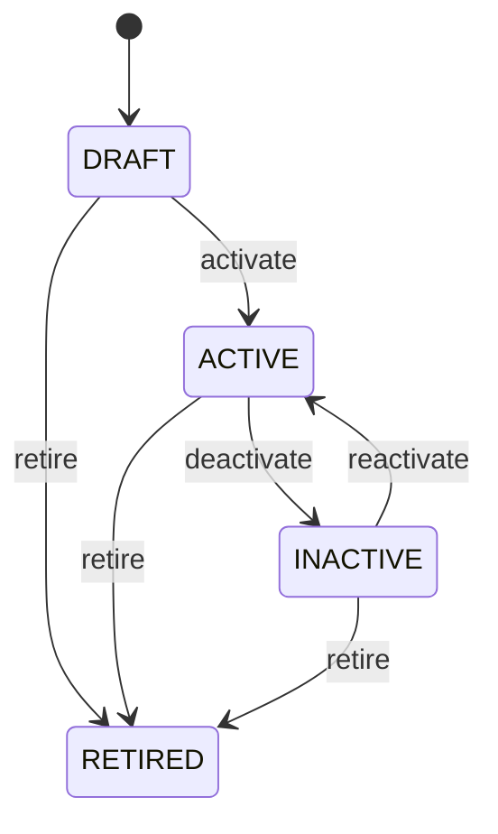

# Organization

Organization is the organizational specialization of Party, not an independent party identity or business role. Party identifies who the organization is; Organization describes intrinsic organizational structure; PartyRole describes how it participates; Customer and Supplier provide commercial behavior. Used across sales, procurement, finance, logistics, contracts, compliance, HR, and enterprise hierarchy. Party → Organization provides identity specialization. Party → PartyRole provides participation. Customer/Supplier must not create duplicate Party identities. Create/maintain Party → create Organization specialization → establish organizational hierarchy → assign PartyRole → apply specialized commercial qualification → permit transactions. Master-data changes affect future eligibility and presentation while historical transactions retain their original context. Organization follows its own master-data lifecycle while remaining subordinate to Party identity consistency. Retirement does not delete historical transactions or roles. One company exists as one Party and one Organization specialization, while holding CUSTOMER and SUPPLIER PartyRoles with separate commercial controls.

## Finding records

Open **Organization** from the menu or from its card on the dashboard.

The list shows Party, Code, Name, Organization Type, Status, Legal Name, Registration Number, with the most recently changed record first. The **Help** button beside the title opens this window's help text.

- **Search**: type in the search box above the grid to narrow the rows. **Search** at the top left opens advanced search, where you pick a field, a comparison (equals, contains, starts with, before, after, and so on) and a value.
- **Sort**: click a column heading; click again to reverse.
- **Refresh**: the refresh button at the top right re-reads the rows and every dropdown, so a record created a moment ago by someone else appears.
- **Export**: **CSV** downloads the rows you are looking at.
- **Open a record**: click a row. The line under the title, "Showing 1 to n of N entries", tells you how many rows match.

## Creating a record

Choose **New** at the top of the list. The form opens on its own page, with the fields in sections. A badge beside each label names the control (Text, Dropdown, Date, and so on); a red star marks a required field; the question-mark icon shows that field's help; and a hint such as “max 300” shows the longest entry accepted.

1. Fill in the fields described under [Fields](#fields).
2. These are required and must be completed before the record can be saved: **Party**, **Code**, **Name**, **Organization Type**, **Status**, **Party Type**, **Display Name**.
3. For a dropdown that points at another window, pick the matching record; if the record you need does not exist yet, create it in its own window first. A dropdown may narrow to what you have already chosen, for example the states of the chosen country.
4. Choose **Create** (or **Save** in the toolbar). You return to the record, and it appears at the top of the list. If something is wrong the form says which field and why, and nothing is saved.

## Reading, changing and deleting a record

Click a row to open the record. Above the fields are the arrows that step through the list ("1 of 5"). Below them sit **Notes**, where anyone may leave a comment on the record, and the **Audit Trail**, which lists every change with who made it, when, and which fields changed.

- **Edit** (toolbar) makes the fields editable. Change them and choose **Save**; **Undo Changes** puts back what you changed and **Cancel Editing** leaves edit mode.
- **Copy Record** starts a new record from this one.
- **Delete Record** is available in edit mode and asks you to confirm; a record other records still depend on cannot be deleted.

Every change is also written to the [Audit Log](/administration/#audit-log).

## Fields

| Field | What you use | Rules | What to enter |
| --- | --- | --- | --- |
| Party | Lookup | Required, Unique | Canonical Party identity represented by this Organization specialization. Connects organizational details to the shared Party identity used by all roles and transactions. One Party may have exactly one Organization specialization when partyType is ORGANIZATION. Ensures Customer, Supplier, Owner, and other roles resolve to the same underlying organization. Required to prevent duplicate party identity. Pick a record from **Party**. |
| Code | Text | Required, Up to 50 characters | Business code for the organization within its governed business context. Used for operations, reporting, integrations, and organizational selection. Code is not the canonical Party identity and uniqueness is governed by organization scope. Provides operational reference for organization hierarchy and business context. Required where the organization participates in governed operational processes. |
| Name | Text | Required, Up to 200 characters | Common organizational name used in business operations. Used in search, forms, reports, documents, and transactions. LegalName may differ and provides formal legal identity. Provides human-readable organizational identification. Required for operational recognition. |
| Organization Type | Choice | Required | Classifies the organizational structure represented by the specialization. Used for hierarchy, authorization, reporting, transaction scope, and organizational configuration. Organization type describes structure, not commercial role. Customer/Supplier behavior belongs to PartyRole specializations. Controls applicable organizational hierarchy and operating-context rules. Required for organizational interpretation. The organization type of the organization is enterprise; set it when that is what the business means for this record. The organization type of the organization is company; set it when that is what the business means for this record. The organization type of the organization is business unit; set it when that is what the business means for this record. The organization type of the organization is division; set it when that is what the business means for this record. The organization type of the organization is department; set it when that is what the business means for this record. The organization type of the organization is branch; set it when that is what the business means for this record. The organization type of the organization is subsidiary; set it when that is what the business means for this record. The organization type of the organization is other; set it when that is what the business means for this record. Choose one: Enterprise, Company, Business unit, Division, Department, Branch, Subsidiary, Other. |
| Status | Choice | Required | Lifecycle of the organizational specialization. Controls whether the organization can normally be selected as an organizational context. Organization status does not replace Party.status or PartyRole.status; all applicable states must permit new activity. Governs organizational use while preserving historical relationships. Required for eligibility checks. The status of the organization is draft; set it when that is what the business means for this record. The status of the organization is active; set it when that is what the business means for this record. The status of the organization is inactive; set it when that is what the business means for this record. The status of the organization is retired; set it when that is what the business means for this record. Choose one: Draft, Active, Inactive, Retired. |
| Legal Name | Text | Up to 300 characters | Formal legal name of the organization. Used for contracts, invoices, tax, regulatory reporting, and legal documentation. LegalName is distinct from the operational name. Supplies legal presentation and compliance context. Optional when the organization is not a legal entity or the information is not yet known. |
| Registration Number | Text | Up to 100 characters | Registration identifier assigned by a competent authority. Used for legal verification, compliance, tax, and integrations. Registration number identifies the organization in an external legal system, not in CEDM. Supports identity verification and compliance controls. Optional for organizational units without separate registration. |
| Tax Identifier | Text | Up to 100 characters | Tax identifier applicable to the organization in a relevant jurisdiction. Used for tax determination, invoices, reporting, and compliance. Tax identity may vary by jurisdiction and should not replace Party identity. Supports tax-rule applicability and statutory reporting. Optional when no tax identifier applies or is known. |
| Party Type | Choice | Required | Identifies whether the party is a person or an organization. Determines which party specialization is applicable and prevents business processes from interpreting an organization as an individual or vice versa. Used to select Person or Organization details and to drive validation, forms, search, reporting, and role assignment. PERSON requires the Person specialization; ORGANIZATION requires the Organization specialization. The party represents an individual human being. The party represents a legal, commercial, governmental, nonprofit, or other organized body. Required because the party's specialization and applicable business semantics depend on it. Choose one: Person, Organization. |
| Display Name | Text | Required, Up to 300 characters | The business-facing name by which the party is normally displayed and recognized. Provides a consistent human-readable representation independent of whether the party is a person or organization. Used in forms, search results, documents, transactions, reports, notifications, and user interfaces. It is a presentation identity for the Party and does not replace legal names, person names, or organization registration names stored by specializations. Required so every party can be unambiguously presented to users and business processes. |
| External Reference | Text | Up to 200 characters | An identifier assigned to the party by an external system or business partner. Preserves a cross-system identity that allows CEDM to reconcile a party with another master-data system. Used for integrations, migration, reconciliation, EDI, synchronization, and external lookup. It is not the canonical CEDM identity; Party.partyId remains the internal identity while externalReference provides interoperability context. Optional when no external system identity exists or when the external identity is maintained elsewhere. |
| Person | Lookup | Optional | The Person this Organization belongs to. Pick a record from **Person**. |
| Parent Organization | Lookup | Optional | Immediate parent organizational unit. Supports enterprise hierarchy and organizational scope. Zero or one immediate parent. Determines inherited organizational context where explicitly supported. Pick a record from **Parent Organization**. |

## How it connects to other records
- A organization has one **Party**.
- A organization belongs to one **Person**.
- A organization has many **Organization** records.
- A organization has many **Address** records.
- A organization has many **Location** records.
- A organization has many **Party Role** records.
- A organization has many **Business Unit** records.
- A organization has many **Department** records.
- A organization has many **Task** records.
- A organization has many **Research Project** records.

## Lifecycle: Organization lifecycle

A organization record starts as **Draft** and ends as **Retired**. Open a record and the bar above its fields shows its current **State** and, after **Next**, a button for each move that leaves it; choose one to make the move. Any move the diagram does not draw is refused, for everyone including the administrator.

| From | To | Move |
| --- | --- | --- |
| Draft | Active | Activate |
| Active | Inactive | Deactivate |
| Inactive | Active | Reactivate |
| Draft | Retired | Retire |
| Active | Retired | Retire |
| Inactive | Retired | Retire |

## Who may use it

Anyone who holds a role with access to the **Organization** window. Access is granted by role under [Roles and access](/administration/access/).
