# Record lifecycles

A lifecycle is the set of states a record can be in and the moves between them. The application enforces it on every write, through the screen and through the API: a move the diagram does not draw is refused for everyone, administrators included. Role restrictions narrow who may make a particular move. This application has **22** lifecycles.


## Party: Party lifecycle

States: **Active**, **Inactive**, **Blocked**, **Retired**. A new record starts as **Active**; **Retired** ends the lifecycle.

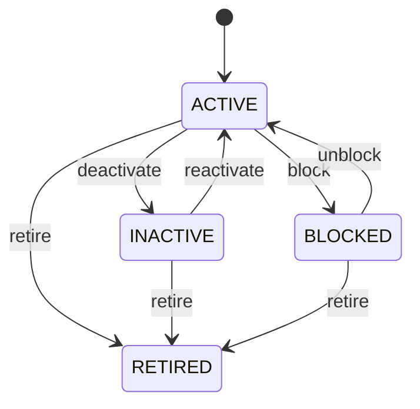

Any role that may change the record may make any move the diagram draws.


See [Party](/entities/foundation/party/) for the record itself.

## Organization: Organization lifecycle

States: **Draft**, **Active**, **Inactive**, **Retired**. A new record starts as **Draft**; **Retired** ends the lifecycle.

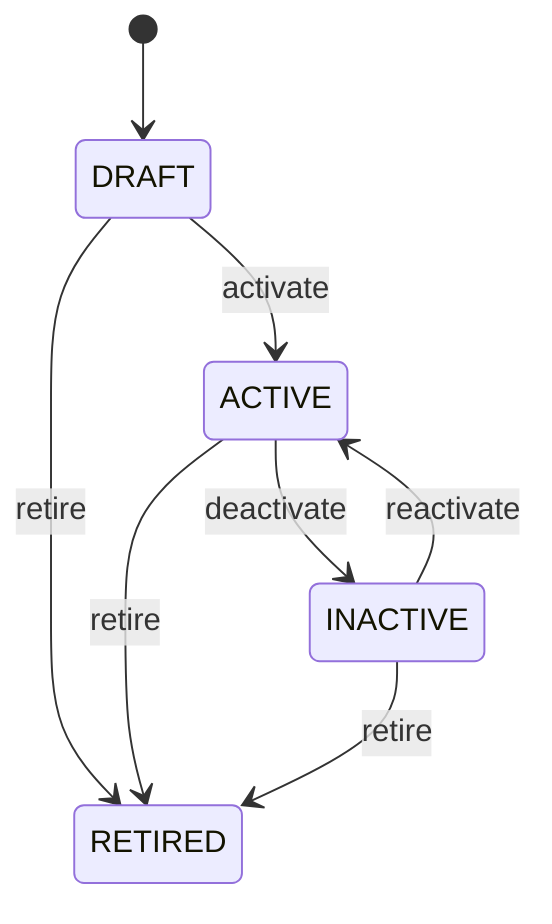

Any role that may change the record may make any move the diagram draws.


See [Organization](/entities/foundation/organization/) for the record itself.

## Party Role: Party role lifecycle

States: **Active**, **Inactive**, **Expired**. A new record starts as **Active**; **Expired** ends the lifecycle.

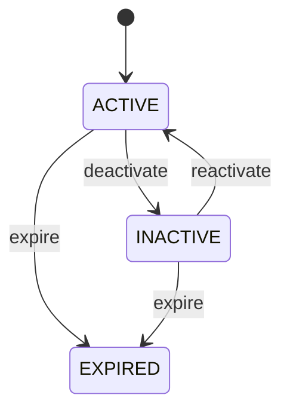

Any role that may change the record may make any move the diagram draws.


See [Party Role](/entities/foundation/party-role/) for the record itself.

## Address: Address lifecycle

States: **Active**, **Inactive**, **Retired**. A new record starts as **Active**; **Retired** ends the lifecycle.

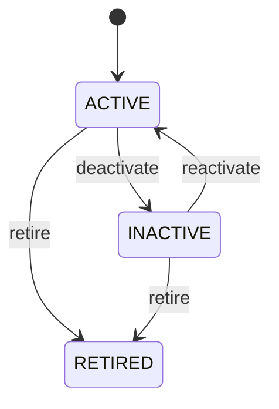

Any role that may change the record may make any move the diagram draws.


See [Address](/entities/foundation/address/) for the record itself.

## Location: Location lifecycle

States: **Planned**, **Active**, **Inactive**, **Closed**, **Retired**. A new record starts as **Planned**; **Closed**, **Retired** ends the lifecycle.

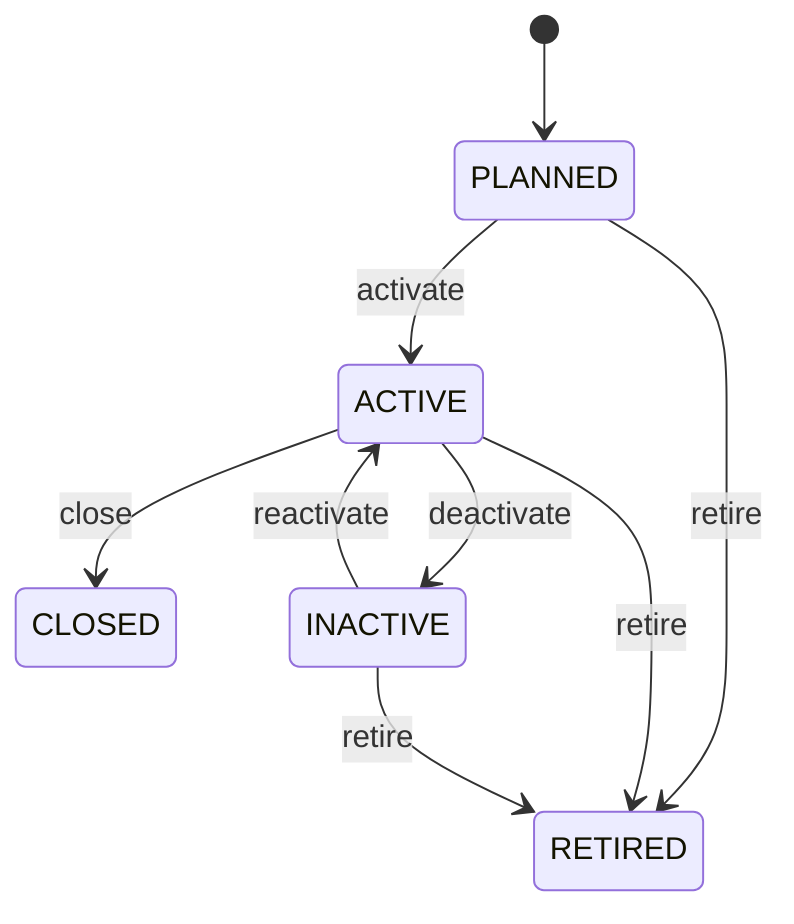

Any role that may change the record may make any move the diagram draws.


See [Location](/entities/foundation/location/) for the record itself.

## Currency: Currency lifecycle

States: **Active**, **Inactive**, **Retired**. A new record starts as **Active**; **Retired** ends the lifecycle.


Any role that may change the record may make any move the diagram draws.


See [Currency](/entities/foundation/currency/) for the record itself.

## Exchange Rate: Exchange rate lifecycle

States: **Draft**, **Active**, **Expired**, **Cancelled**. A new record starts as **Draft**; **Expired**, **Cancelled** ends the lifecycle.

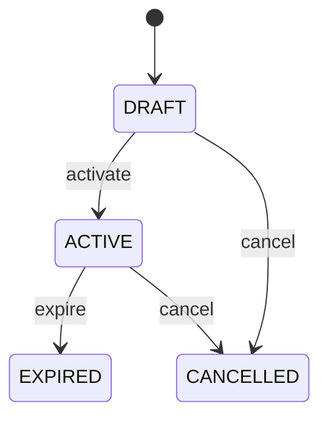

Any role that may change the record may make any move the diagram draws.


See [Exchange Rate](/entities/foundation/exchange-rate/) for the record itself.

## Unit Of Measure: Unit of measure lifecycle

States: **Active**, **Inactive**, **Retired**. A new record starts as **Active**; **Retired** ends the lifecycle.


Any role that may change the record may make any move the diagram draws.


See [Unit Of Measure](/entities/foundation/unit-of-measure/) for the record itself.

## Task: Task lifecycle

States: **Created**, **Ready**, **Assigned**, **In progress**, **Blocked**, **Completed**, **Cancelled**, **Failed**. A new record starts as **Created**; **Completed**, **Cancelled**, **Failed** ends the lifecycle.

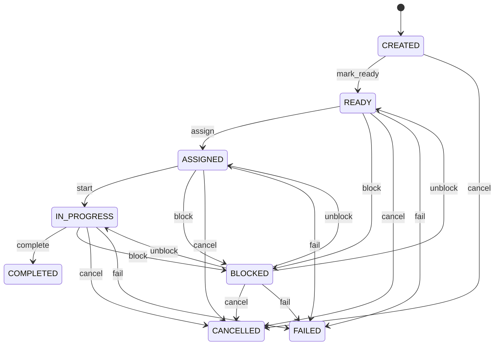

Any role that may change the record may make any move the diagram draws.


See [Task](/entities/foundation/task/) for the record itself.

## Customer: Customer lifecycle

States: **Active**, **Inactive**, **Blocked**, **Retired**. A new record starts as **Active**; **Retired** ends the lifecycle.


Any role that may change the record may make any move the diagram draws.


See [Customer](/entities/sales/customer/) for the record itself.

## Lead: Lead lifecycle

States: **New**, **Qualifying**, **Qualified**, **Disqualified**, **Converted**, **Lost**. A new record starts as **New**; **Lost** ends the lifecycle.

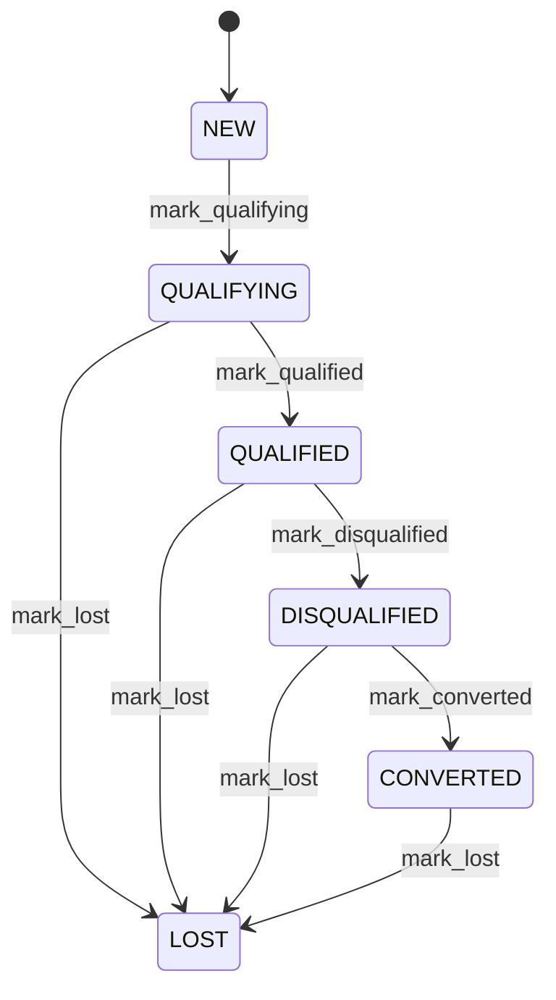

Any role that may change the record may make any move the diagram draws.


See [Lead](/entities/sales/lead/) for the record itself.

## Opportunity: Opportunity lifecycle

States: **Qualification**, **Discovery**, **Proposal**, **Negotiation**, **Won**, **Lost**. A new record starts as **Qualification**; **Lost** ends the lifecycle.

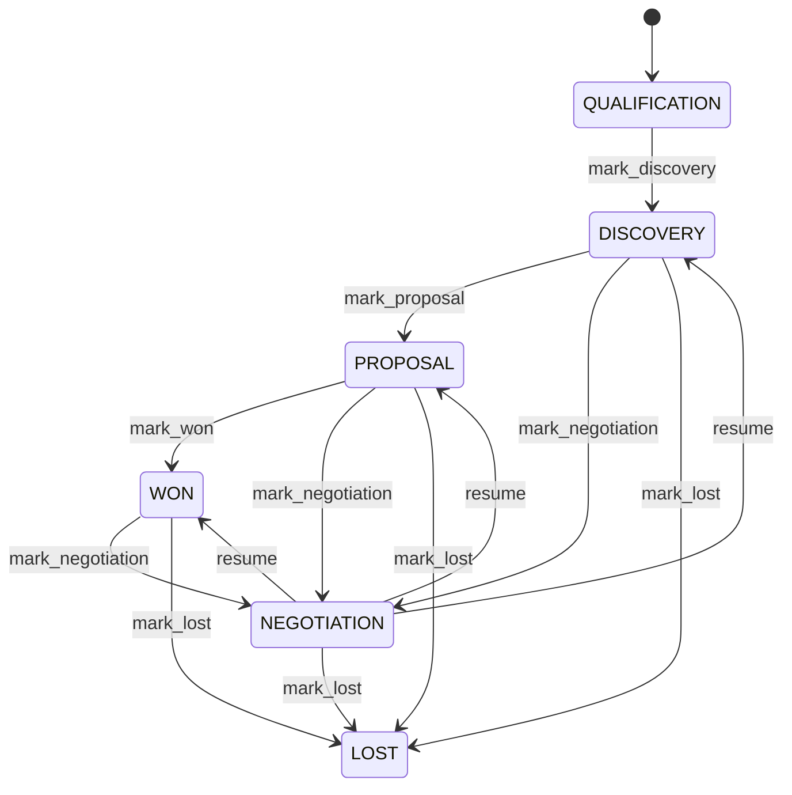

Any role that may change the record may make any move the diagram draws.


See [Opportunity](/entities/sales/opportunity/) for the record itself.

## Quotation: Quotation lifecycle

States: **Draft**, **Submitted**, **Accepted**, **Rejected**, **Expired**, **Cancelled**. A new record starts as **Draft**; **Rejected**, **Expired**, **Cancelled** ends the lifecycle.

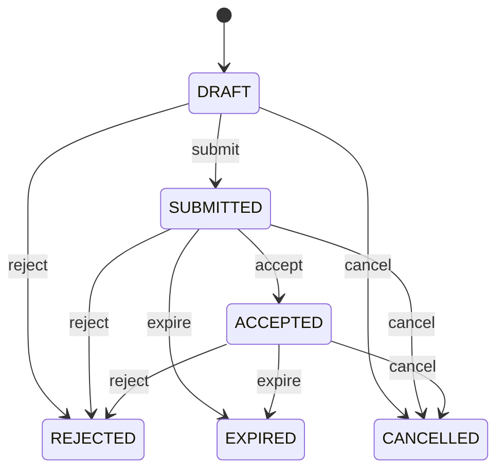

Any role that may change the record may make any move the diagram draws.


See [Quotation](/entities/sales/quotation/) for the record itself.

## Sales Order: Sales order lifecycle

States: **Draft**, **Confirmed**, **Allocated**, **Partially fulfilled**, **Fulfilled**, **Cancelled**. A new record starts as **Draft**; **Fulfilled**, **Cancelled** ends the lifecycle.

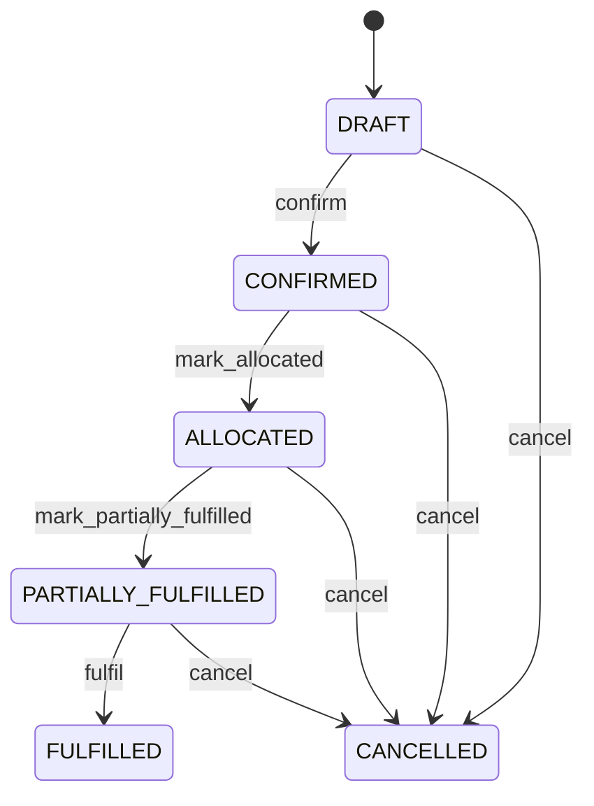

Any role that may change the record may make any move the diagram draws.


See [Sales Order](/entities/sales/sales-order/) for the record itself.

## Purchase Order: Purchase order lifecycle

States: **Draft**, **Approved**, **Sent**, **Partially received**, **Received**, **Cancelled**, **Closed**. A new record starts as **Draft**; **Closed**, **Cancelled** ends the lifecycle.

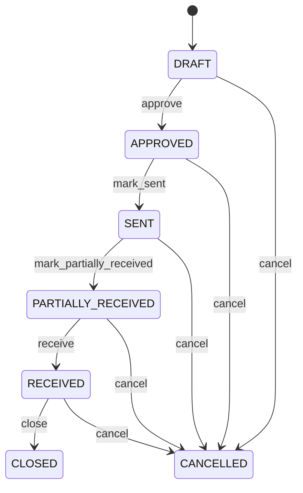

Any role that may change the record may make any move the diagram draws.


See [Purchase Order](/entities/order-management/purchase-order/) for the record itself.

## Product: Product lifecycle

States: **Draft**, **Active**, **Discontinued**, **Blocked**, **Retired**. A new record starts as **Draft**; **Discontinued**, **Retired** ends the lifecycle.

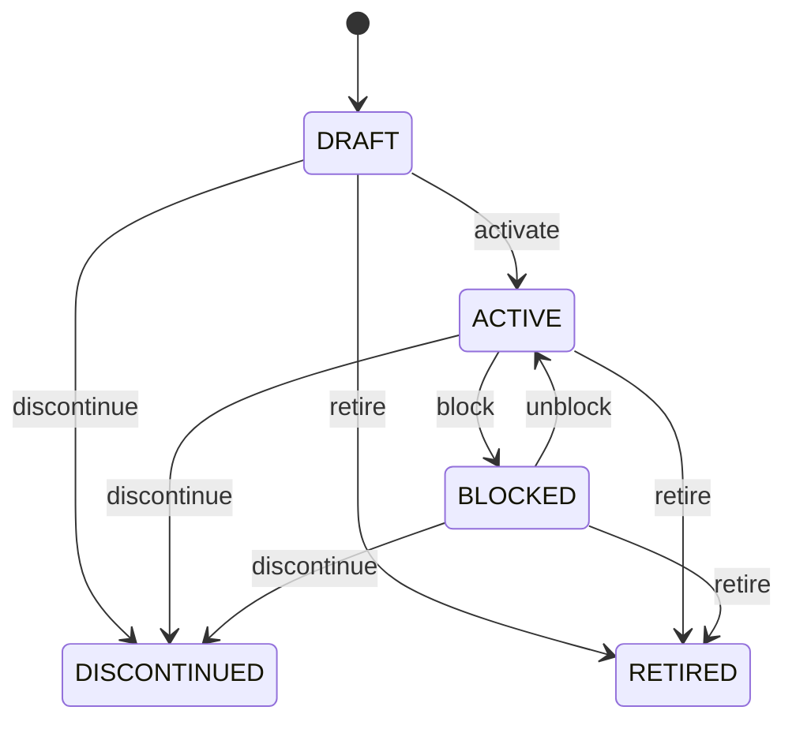

Any role that may change the record may make any move the diagram draws.


See [Product](/entities/pricing-and-commercial-terms/product/) for the record itself.

## Supplier: Supplier lifecycle

States: **Active**, **Inactive**, **Blocked**, **Retired**. A new record starts as **Active**; **Retired** ends the lifecycle.


Any role that may change the record may make any move the diagram draws.


See [Supplier](/entities/pricing-and-commercial-terms/supplier/) for the record itself.

## Payment Term: Payment term lifecycle

States: **Active**, **Inactive**, **Retired**. A new record starts as **Active**; **Retired** ends the lifecycle.


Any role that may change the record may make any move the diagram draws.


See [Payment Term](/entities/pricing-and-commercial-terms/payment-term/) for the record itself.

## Product Category: Product category lifecycle

States: **Active**, **Inactive**, **Retired**. A new record starts as **Active**; **Retired** ends the lifecycle.


Any role that may change the record may make any move the diagram draws.


See [Product Category](/entities/product-and-service-management/product-category/) for the record itself.

## Discount Rule: Discount rule lifecycle

States: **Draft**, **Active**, **Inactive**, **Retired**. A new record starts as **Draft**; **Retired** ends the lifecycle.


Any role that may change the record may make any move the diagram draws.


See [Discount Rule](/entities/sales-and-order-management-records/discount-rule/) for the record itself.

## Customer Return: Customer return lifecycle

States: **Draft**, **Authorized**, **In transit**, **Received**, **Inspection pending**, **Dispositioned**, **Completed**, **Cancelled**, **Exception**. A new record starts as **Draft**; **Dispositioned**, **Cancelled** ends the lifecycle.

```mermaid
stateDiagram-v2
  [*] --> DRAFT
  DRAFT --> AUTHORIZED: authorize
  AUTHORIZED --> IN_TRANSIT: mark_in_transit
  IN_TRANSIT --> RECEIVED: receive
  RECEIVED --> COMPLETED: complete
  COMPLETED --> DISPOSITIONED: mark_dispositioned
  AUTHORIZED --> INSPECTION_PENDING: mark_inspection_pending
  INSPECTION_PENDING --> AUTHORIZED: resume
  IN_TRANSIT --> INSPECTION_PENDING: mark_inspection_pending
  INSPECTION_PENDING --> IN_TRANSIT: resume
  RECEIVED --> INSPECTION_PENDING: mark_inspection_pending
  INSPECTION_PENDING --> RECEIVED: resume
  AUTHORIZED --> EXCEPTION: mark_exception
  EXCEPTION --> AUTHORIZED: resolve_exception
  IN_TRANSIT --> EXCEPTION: mark_exception
  EXCEPTION --> IN_TRANSIT: resolve_exception
  RECEIVED --> EXCEPTION: mark_exception
  EXCEPTION --> RECEIVED: resolve_exception
  DRAFT --> CANCELLED: cancel
  AUTHORIZED --> CANCELLED: cancel
  IN_TRANSIT --> CANCELLED: cancel
  RECEIVED --> CANCELLED: cancel
  INSPECTION_PENDING --> CANCELLED: cancel
  EXCEPTION --> CANCELLED: cancel
```

Any role that may change the record may make any move the diagram draws.


See [Customer Return](/entities/sales-and-order-management-records/customer-return/) for the record itself.

## Brand: Brand lifecycle

States: **Active**, **Inactive**, **Retired**. A new record starts as **Active**; **Retired** ends the lifecycle.

```mermaid
stateDiagram-v2
  [*] --> ACTIVE
  ACTIVE --> INACTIVE: deactivate
  INACTIVE --> ACTIVE: reactivate
  ACTIVE --> RETIRED: retire
  INACTIVE --> RETIRED: retire
```

Any role that may change the record may make any move the diagram draws.


See [Brand](/entities/sales-and-order-management-records/brand/) for the record itself.

