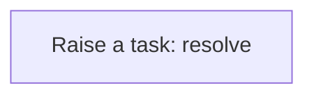
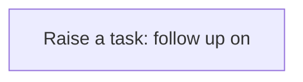
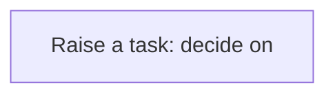
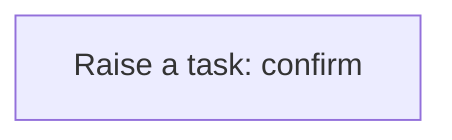

# Processes

A process is a sequence of steps the application runs for you: create a task, update a record, call a service. A business rule usually starts it; you can also run one by hand from the Workflow Designer. Every run is logged step by step in the Workflow Monitor. This application has **13** processes.

## Party exception raised {#party-exception-raised}

When a party is blocked, a high-priority task asks someone to resolve it.

Runs when a **Party** is changed, started by a business rule.

1. **Raise a task: resolve** — creates a **Task** record.

## Exchange rate follow up required {#exchange-rate-follow-up-required}

When a exchange rate is cancelled, a task asks someone to settle what depended on it.

Runs when a **Exchange Rate** is changed, started by a business rule.

1. **Raise a task: follow up on** — creates a **Task** record.

## Customer exception raised {#customer-exception-raised}

When a customer is blocked, a high-priority task asks someone to resolve it.

Runs when a **Customer** is changed, started by a business rule.

1. **Raise a task: resolve** — creates a **Task** record.

## Quotation approval requested {#quotation-approval-requested}

When a quotation is submitted, a task asks someone to decide on it.

Runs when a **Quotation** is changed, started by a business rule.

1. **Raise a task: decide on** — creates a **Task** record.

## Quotation follow up required {#quotation-follow-up-required}

When a quotation is rejected or cancelled, a task asks someone to settle what depended on it.

Runs when a **Quotation** is changed, started by a business rule.

1. **Raise a task: follow up on** — creates a **Task** record.

## Sales order follow up required {#sales-order-follow-up-required}

When a sales order is cancelled, a task asks someone to settle what depended on it.

Runs when a **Sales Order** is changed, started by a business rule.

1. **Raise a task: follow up on** — creates a **Task** record.

## Sales order completion confirmed {#sales-order-completion-confirmed}

When a sales order is fulfilled, a task asks someone to confirm the outcome.

Runs when a **Sales Order** is changed, started by a business rule.

1. **Raise a task: confirm** — creates a **Task** record.

## Purchase order follow up required {#purchase-order-follow-up-required}

When a purchase order is cancelled, a task asks someone to settle what depended on it.

Runs when a **Purchase Order** is changed, started by a business rule.

1. **Raise a task: follow up on** — creates a **Task** record.

## Product exception raised {#product-exception-raised}

When a product is blocked, a high-priority task asks someone to resolve it.

Runs when a **Product** is changed, started by a business rule.

1. **Raise a task: resolve** — creates a **Task** record.

## Supplier exception raised {#supplier-exception-raised}

When a supplier is blocked, a high-priority task asks someone to resolve it.

Runs when a **Supplier** is changed, started by a business rule.

1. **Raise a task: resolve** — creates a **Task** record.

## Customer return exception raised {#customer-return-exception-raised}

When a customer return is exception, a high-priority task asks someone to resolve it.

Runs when a **Customer Return** is changed, started by a business rule.

1. **Raise a task: resolve** — creates a **Task** record.

## Customer return follow up required {#customer-return-follow-up-required}

When a customer return is cancelled, a task asks someone to settle what depended on it.

Runs when a **Customer Return** is changed, started by a business rule.

1. **Raise a task: follow up on** — creates a **Task** record.

## Customer return completion confirmed {#customer-return-completion-confirmed}

When a customer return is completed, a task asks someone to confirm the outcome.

Runs when a **Customer Return** is changed, started by a business rule.

1. **Raise a task: confirm** — creates a **Task** record.

