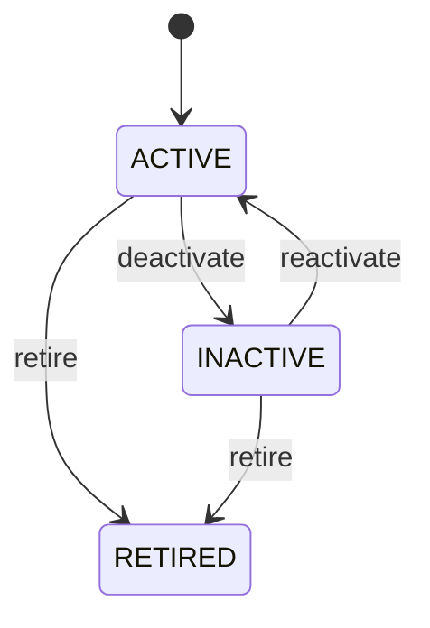

# Currency

Defines the monetary denomination that gives financial amounts their business meaning. Currency is not an amount. It defines the denomination in which an amount is stated and provides the reference needed for pricing, billing, settlement, banking, and accounting. Central to Product pricing, SalesOrder, Invoice, Payment, PaymentAllocation, BankTransaction, JournalEntry, ExchangeRate, and financial reporting. Product may carry reference pricing. SalesOrder establishes commercial amounts. Invoice establishes claims. Payment establishes settlement. PaymentAllocation applies settlement to claims. BankTransaction supplies external evidence. JournalEntry records accounting recognition. ExchangeRate provides auditable conversion between Currency denominations. Price → SalesOrder → Invoice → Payment → PaymentAllocation → BankTransaction reconciliation → JournalEntry. When currencies differ, an approved ExchangeRate and explicit rounding/conversion policy must be used; Currency master data never substitutes for an exchange-rate record. Currency is activated for use, may become inactive, and may eventually be retired. Lifecycle changes affect future transactions only and preserve historical financial evidence. A SalesOrder is denominated in USD and an Invoice is issued in USD. A customer pays in EUR. Payment records EUR, PaymentAllocation records the approved ExchangeRate and conversion context needed to settle the USD invoice, BankTransaction provides bank evidence in EUR, and accounting retains the rate used rather than later recalculating the historical settlement.

## Finding records

Open **Currency** from the menu or from its card on the dashboard.

The list shows Code, Name, Symbol, Decimal Places, Status, with the most recently changed record first. The **Help** button beside the title opens this window's help text.

- **Search**: type in the search box above the grid to narrow the rows. **Search** at the top left opens advanced search, where you pick a field, a comparison (equals, contains, starts with, before, after, and so on) and a value.
- **Sort**: click a column heading; click again to reverse.
- **Refresh**: the refresh button at the top right re-reads the rows and every dropdown, so a record created a moment ago by someone else appears.
- **Export**: **CSV** downloads the rows you are looking at.
- **Open a record**: click a row. The line under the title, "Showing 1 to n of N entries", tells you how many rows match.

## Creating a record

Choose **New** at the top of the list. The form opens on its own page, with the fields in sections. A badge beside each label names the control (Text, Dropdown, Date, and so on); a red star marks a required field; the question-mark icon shows that field's help; and a hint such as “max 300” shows the longest entry accepted.

1. Fill in the fields described under [Fields](#fields).
2. These are required and must be completed before the record can be saved: **Code**, **Name**, **Decimal Places**, **Status**.
3. For a dropdown that points at another window, pick the matching record; if the record you need does not exist yet, create it in its own window first. A dropdown may narrow to what you have already chosen, for example the states of the chosen country.
4. Choose **Create** (or **Save** in the toolbar). You return to the record, and it appears at the top of the list. If something is wrong the form says which field and why, and nothing is saved.

## Reading, changing and deleting a record

Click a row to open the record. Above the fields are the arrows that step through the list ("1 of 5"). Below them sit **Notes**, where anyone may leave a comment on the record, and the **Audit Trail**, which lists every change with who made it, when, and which fields changed.

- **Edit** (toolbar) makes the fields editable. Change them and choose **Save**; **Undo Changes** puts back what you changed and **Cancel Editing** leaves edit mode.
- **Copy Record** starts a new record from this one.
- **Delete Record** is available in edit mode and asks you to confirm; a record other records still depend on cannot be deleted.

Every change is also written to the [Audit Log](/administration/#audit-log).

## Fields

| Field | What you use | Rules | What to enter |
| --- | --- | --- | --- |
| Code | Text | Required, Unique, Up to 3 characters | Three-letter business currency code, normally an ISO 4217 code where one exists. Used in documents, APIs, integrations, reports, pricing, banking, and accounting. Code identifies the denomination and is not an exchange rate or amount. Provides the currency identity carried through order, invoice, payment, bank, and ledger workflows. Required for interoperable monetary representation. |
| Name | Text | Required, Up to 100 characters | Human-readable currency name. Used in user interfaces, documents, reports, master-data management, and integrations. Describes the currency identified by code and currencyId. Provides understandable monetary context to business users. Required for usable currency master data. |
| Symbol | Text | Up to 10 characters | Common display symbol for the currency. Used in user interfaces, customer documents, reports, and formatted amounts. Presentation metadata; it must not be used as the canonical currency identity. Improves human-readable display without affecting financial calculations. Optional where no standard symbol or display policy exists. |
| Decimal Places | Whole number | Required | Standard number of decimal places normally used when representing amounts in this currency. Used for amount formatting, rounding, validation, invoicing, payment processing, and accounting presentation. Transaction-specific precision or financial-system rules may be stricter; this field does not itself define rounding policy. Supplies a currency-level precision baseline to monetary workflows. Required because monetary amounts must have predictable representation. |
| Status | Choice | Required | Controls whether the currency is available for new monetary transactions. Used by pricing, order, invoicing, payment, banking, and accounting validation. Retiring a currency must not invalidate historical transactions expressed in that currency. New transactions should use ACTIVE currencies unless an authorized legacy exception applies. Available for normal financial activity. Temporarily unavailable for new normal activity. No longer available for new normal activity while historical financial records remain valid. Required for transaction eligibility. Choose one: Active, Inactive, Retired. |

## How it connects to other records
- A currency has many **Country** records.
- A currency has many **Product** records.
- A currency has many **Sales Order** records.
- A currency has many **Exchange Rate** records.
- A currency has many **Discount Rule** records.

## Lifecycle: Currency lifecycle

A currency record starts as **Active** and ends as **Retired**. Open a record and the bar above its fields shows its current **State** and, after **Next**, a button for each move that leaves it; choose one to make the move. Any move the diagram does not draw is refused, for everyone including the administrator.

| From | To | Move |
| --- | --- | --- |
| Active | Inactive | Deactivate |
| Inactive | Active | Reactivate |
| Active | Retired | Retire |
| Inactive | Retired | Retire |

## Who may use it

Anyone who holds a role with access to the **Currency** window. Access is granted by role under [Roles and access](/administration/access/).
