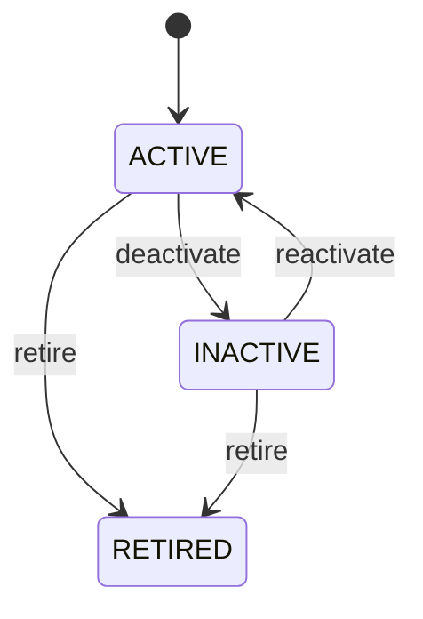

# Payment Term

Defines reusable commercial rules for when financial obligations become due and when early-settlement benefits or operational grace periods apply. PaymentTerm is a policy definition; an actual Invoice due date is a transaction-level result calculated from that policy and the applicable business event. Central to customer credit, supplier procurement, SalesOrder, PurchaseOrder, Invoice, receivables, payables, collections, cash forecasting, and payment scheduling. Customer and Supplier provide default role-level terms. SalesOrder and PurchaseOrder provide transaction context. Invoice derives an actual due date. Payment settles the obligation; PaymentTerm does not itself represent a Payment. Customer/Supplier default → SalesOrder/PurchaseOrder selection → Invoice creation → due-date calculation → receivable/payable aging → Payment scheduling → settlement. A term may be overridden by an authorized contract or transaction-level agreement, but the effective term used for an issued financial document must remain auditable. Payment terms can be created, activated, made inactive, and retired. Master-data changes affect future selection; issued transaction terms and calculated due dates remain historically stable unless formally amended. NET30 with INVOICE_DATE and dueDays 30 means an invoice issued on 10 August has a nominal due date of 9 September. If the term also specifies 2% within 10 days, the early-payment window is separately evaluated; the PaymentTerm does not itself create or allocate a payment.

## Finding records

Open **Payment Term** from the menu or from its card on the dashboard.

The list shows Code, Name, Due Days, Due Date Basis, Discount Days, Discount Percent, Grace Days, with the most recently changed record first. The **Help** button beside the title opens this window's help text.

- **Search**: type in the search box above the grid to narrow the rows. **Search** at the top left opens advanced search, where you pick a field, a comparison (equals, contains, starts with, before, after, and so on) and a value.
- **Sort**: click a column heading; click again to reverse.
- **Refresh**: the refresh button at the top right re-reads the rows and every dropdown, so a record created a moment ago by someone else appears.
- **Export**: **CSV** downloads the rows you are looking at.
- **Open a record**: click a row. The line under the title, "Showing 1 to n of N entries", tells you how many rows match.

## Creating a record

Choose **New** at the top of the list. The form opens on its own page, with the fields in sections. A badge beside each label names the control (Text, Dropdown, Date, and so on); a red star marks a required field; the question-mark icon shows that field's help; and a hint such as “max 300” shows the longest entry accepted.

1. Fill in the fields described under [Fields](#fields).
2. These are required and must be completed before the record can be saved: **Code**, **Name**, **Due Days**, **Due Date Basis**, **Status**.
3. For a dropdown that points at another window, pick the matching record; if the record you need does not exist yet, create it in its own window first. A dropdown may narrow to what you have already chosen, for example the states of the chosen country.
4. Choose **Create** (or **Save** in the toolbar). You return to the record, and it appears at the top of the list. If something is wrong the form says which field and why, and nothing is saved.

## Reading, changing and deleting a record

Click a row to open the record. Above the fields are the arrows that step through the list ("1 of 5"). Below them sit **Notes**, where anyone may leave a comment on the record, and the **Audit Trail**, which lists every change with who made it, when, and which fields changed.

- **Edit** (toolbar) makes the fields editable. Change them and choose **Save**; **Undo Changes** puts back what you changed and **Cancel Editing** leaves edit mode.
- **Copy Record** starts a new record from this one.
- **Delete Record** is available in edit mode and asks you to confirm; a record other records still depend on cannot be deleted.

Every change is also written to the [Audit Log](/administration/#audit-log).

## Fields

| Field | What you use | Rules | What to enter |
| --- | --- | --- | --- |
| Code | Text | Required, Unique, Up to 50 characters | Business code for the payment-term policy, such as NET30 or DUE_ON_RECEIPT. Used in customer/supplier master data, order entry, procurement, invoices, reports, and integrations. Code identifies the reusable policy; it is not itself a due date. Provides a selectable default during commercial transaction creation. Required for operational identification. |
| Name | Text | Required, Up to 150 characters | Human-readable name of the settlement-timing policy. Used in configuration, forms, documents, reporting, and user selection. Describes the policy represented by code and paymentTermId. Makes commercial settlement conditions understandable during order, procurement, and billing processes. Required for usable master data. |
| Due Days | Whole number | Required | Number of calendar days normally added to the applicable due-date base event to calculate contractual payment due date. Used by Invoice and receivables/payables processes to calculate expected settlement dates. Must be interpreted with dueDateBasis; it is not necessarily calculated from order date. Converts a transaction's defined due-date basis into a scheduled due date. Required for terms based on a day offset, including zero days. |
| Due Date Basis | Choice | Required | Defines the business event from which dueDays is calculated. Used by invoicing, accounts receivable, accounts payable, collections, and cash-flow forecasting. The basis event comes from the applicable transaction workflow and may differ between sales and procurement contexts. Determines how the Invoice due date or payable obligation date is derived. Due date is calculated from the invoice issue/accounting date according to policy. Due date is calculated from the applicable delivery event. Due date is calculated from accepted receipt evidence, typically in procurement. Due date is calculated according to month-end terms and the configured day-offset interpretation. A transaction or agreement-specific rule supplies the due-date basis and calculation. Required because dueDays has no complete business meaning without a basis. Choose one: Invoice date, Delivery date, Receipt date, Month end, Custom. |
| Discount Days | Whole number | Optional | Number of days during which an early-payment discount may be available. Used by receivables, payables, payment scheduling, cash forecasting, and discount calculation. Applies only when an early-payment discount rate or amount is also defined. Establishes the time window for discounted settlement. Optional when no early-payment discount is offered. |
| Discount Percent | Amount | Optional | Percentage reduction available when the applicable obligation is settled within the discount window. Used for payment planning, invoice presentation, cash forecasting, and settlement calculation. Must be interpreted together with discountDays and the applicable transaction amount. Allows Payment scheduling and Invoice terms to determine whether early settlement qualifies for discount. Optional when no percentage discount applies. |
| Grace Days | Whole number | Optional | Additional days allowed after the nominal due date before a policy considers the obligation overdue for a defined process. Used by collections, credit control, late-payment reporting, and supplier payment management. Grace period does not necessarily change the contractual due date; it changes the operational escalation threshold. Separates contractual due date from collection or escalation timing. Optional when no grace period applies. |
| Description | Text | Up to 1000 characters | Human-readable explanation of the payment policy and its operational interpretation. Used in configuration, audit, transaction review, and user guidance. Supplements structured rules and must not be the sole source for due-date calculation. Optional where structured attributes fully describe the policy. |
| Status | Choice | Required | Controls whether the payment-term policy can be selected for new transactions. Used by customer/supplier maintenance, order capture, procurement, invoicing, and contracts. Retiring a term must not change historical transaction due dates that were calculated from it. New transactions normally select ACTIVE terms; historical transactions preserve their effective terms and derived dates. Available for normal new transaction use. Temporarily unavailable for new selection. No longer available for new selection while historical references remain valid. Required for master-data eligibility. Choose one: Active, Inactive, Retired. |

## How it connects to other records
- A payment term has many **Quotation** records.
- A payment term has many **Customer** records.
- A payment term has many **Supplier** records.
- A payment term has many **Sales Order** records.
- A payment term has many **Purchase Order** records.

## Lifecycle: Payment term lifecycle

A payment term record starts as **Active** and ends as **Retired**. Open a record and the bar above its fields shows its current **State** and, after **Next**, a button for each move that leaves it; choose one to make the move. Any move the diagram does not draw is refused, for everyone including the administrator.

| From | To | Move |
| --- | --- | --- |
| Active | Inactive | Deactivate |
| Inactive | Active | Reactivate |
| Active | Retired | Retire |
| Inactive | Retired | Retire |

## What happens when you save
Business rules run around the save. They are listed here and explained in full under [Business rules](/administration/rules/).

| Rule | When | Order |
| --- | --- | --- |
| Payment term invariants before create | before a payment term is created | 100 |
| Payment term invariants before update | before a payment term is changed | 100 |

## Who may use it

Anyone who holds a role with access to the **Payment Term** window. Access is granted by role under [Roles and access](/administration/access/).
