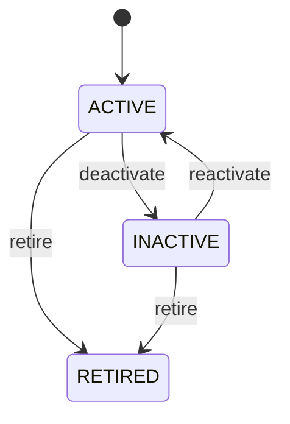

# Product Category

Represents one governed node in the Product classification hierarchy. ProductCategory provides taxonomy rather than operational state. It groups Products so people and systems can navigate, report, analyze, and govern the portfolio consistently. Product master-data management, catalogs, sales, procurement, inventory, reporting, analytics, search, tax, pricing, and eligibility rules where explicitly configured. Product references a category to establish classification. Parent and child categories form the taxonomy. Category hierarchy is distinct from Product composition, BillOfMaterial structure, or organizational hierarchy. Category create/update/retire → validate hierarchy → identify affected Products → identify dependent tax/pricing/sourcing/inventory/reporting rules → validate open workflows → activate change → preserve historical transaction classification. Code/name/description changes primarily affect presentation and integration; parent/status/semantic changes can affect Product eligibility and downstream rules and therefore require dependency analysis. Categories can be introduced, activated, made inactive, and retired. Lifecycle changes govern future classification without deleting historical product relationships or transaction evidence. If "Dry Containers" moves from "Shipping Containers" to another parent, the Product master classification can change for future reporting, but an already issued invoice or historical sales report that requires point-in-time classification must retain the classification effective when the transaction occurred.

## Finding records

Open **Product Category** from the menu or from its card on the dashboard.

The list shows Code, Name, Description, Status, Parent Category, with the most recently changed record first. The **Help** button beside the title opens this window's help text.

- **Search**: type in the search box above the grid to narrow the rows. **Search** at the top left opens advanced search, where you pick a field, a comparison (equals, contains, starts with, before, after, and so on) and a value.
- **Sort**: click a column heading; click again to reverse.
- **Refresh**: the refresh button at the top right re-reads the rows and every dropdown, so a record created a moment ago by someone else appears.
- **Export**: **CSV** downloads the rows you are looking at.
- **Open a record**: click a row. The line under the title, "Showing 1 to n of N entries", tells you how many rows match.

## Creating a record

Choose **New** at the top of the list. The form opens on its own page, with the fields in sections. A badge beside each label names the control (Text, Dropdown, Date, and so on); a red star marks a required field; the question-mark icon shows that field's help; and a hint such as “max 300” shows the longest entry accepted.

1. Fill in the fields described under [Fields](#fields).
2. These are required and must be completed before the record can be saved: **Code**, **Name**, **Status**.
3. For a dropdown that points at another window, pick the matching record; if the record you need does not exist yet, create it in its own window first. A dropdown may narrow to what you have already chosen, for example the states of the chosen country.
4. Choose **Create** (or **Save** in the toolbar). You return to the record, and it appears at the top of the list. If something is wrong the form says which field and why, and nothing is saved.

## Reading, changing and deleting a record

Click a row to open the record. Above the fields are the arrows that step through the list ("1 of 5"). Below them sit **Notes**, where anyone may leave a comment on the record, and the **Audit Trail**, which lists every change with who made it, when, and which fields changed.

- **Edit** (toolbar) makes the fields editable. Change them and choose **Save**; **Undo Changes** puts back what you changed and **Cancel Editing** leaves edit mode.
- **Copy Record** starts a new record from this one.
- **Delete Record** is available in edit mode and asks you to confirm; a record other records still depend on cannot be deleted.

Every change is also written to the [Audit Log](/administration/#audit-log).

## Fields

| Field | What you use | Rules | What to enter |
| --- | --- | --- | --- |
| Code | Text | Required, Unique, Up to 100 characters | The code of the product category: a value the business records on it. Entered or maintained when a product category is created or changed; shown on its form and available to search and reports. Read together with the product category's other fields and its relationships; it is not meaningful on its own. Required: a product category cannot be understood without its code. |
| Name | Text | Required, Up to 200 characters | The name of the product category: a value the business records on it. Entered or maintained when a product category is created or changed; shown on its form and available to search and reports. Read together with the product category's other fields and its relationships; it is not meaningful on its own. Required: a product category cannot be understood without its name. |
| Description | Text | Up to 2000 characters | The description of the product category: a value the business records on it. Entered or maintained when a product category is created or changed; shown on its form and available to search and reports. Read together with the product category's other fields and its relationships; it is not meaningful on its own. |
| Status | Choice | Required | Lifecycle state controlling whether the category can be used for new classification. Set when a category is created and changed as it is taken out of use; filters which categories a product can be classified under. Status changes trigger validation of dependent Products and any rules that consume category classification. The status of the product category is active; set it when that is what the business means for this record. The status of the product category is inactive; set it when that is what the business means for this record. The status of the product category is retired; set it when that is what the business means for this record. Choose one: Active, Inactive, Retired. |
| Parent Category | Lookup | Optional | Links a product category to product category, the parent category it relates to. Chosen from the existing product category records when the product category is created or edited. A product category has at most one product category in this role. Lets the product category be found from, and reported with, its product category. Pick a record from **Product Category**. |

## How it connects to other records
- A product category has many **Product** records.
- A product category has many **Product Category** records.

## Lifecycle: Product category lifecycle

A product category record starts as **Active** and ends as **Retired**. Open a record and the bar above its fields shows its current **State** and, after **Next**, a button for each move that leaves it; choose one to make the move. Any move the diagram does not draw is refused, for everyone including the administrator.

| From | To | Move |
| --- | --- | --- |
| Active | Inactive | Deactivate |
| Inactive | Active | Reactivate |
| Active | Retired | Retire |
| Inactive | Retired | Retire |

## Who may use it

Anyone who holds a role with access to the **Product Category** window. Access is granted by role under [Roles and access](/administration/access/).
