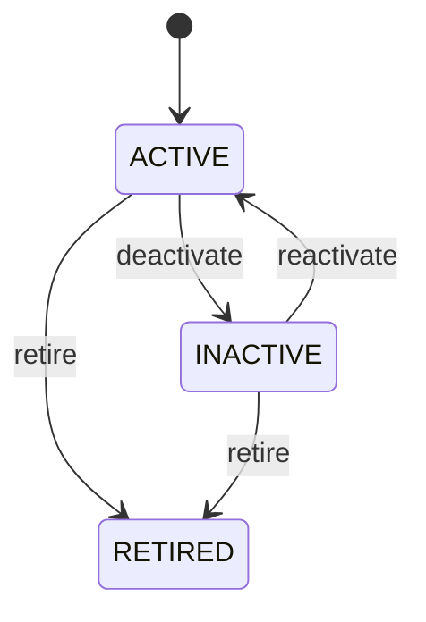

# Brand

Governed product brand reference master. Brand describes commercial/manufacturer identity; it is distinct from ProductCategory taxonomy and Product identity. PIM, catalog, sourcing, sales, e-commerce, service and analytics. Products and variants reference Brand; category remains independent classification. Active → inactive → active or retired. Lifecycle/name changes update future catalog/master usage while preserving historical references.

## Finding records

Open **Brand** from the menu or from its card on the dashboard.

The list shows Code, Name, Status, with the most recently changed record first. The **Help** button beside the title opens this window's help text.

- **Search**: type in the search box above the grid to narrow the rows. **Search** at the top left opens advanced search, where you pick a field, a comparison (equals, contains, starts with, before, after, and so on) and a value.
- **Sort**: click a column heading; click again to reverse.
- **Refresh**: the refresh button at the top right re-reads the rows and every dropdown, so a record created a moment ago by someone else appears.
- **Export**: **CSV** downloads the rows you are looking at.
- **Open a record**: click a row. The line under the title, "Showing 1 to n of N entries", tells you how many rows match.

## Creating a record

Choose **New** at the top of the list. The form opens on its own page, with the fields in sections. A badge beside each label names the control (Text, Dropdown, Date, and so on); a red star marks a required field; the question-mark icon shows that field's help; and a hint such as “max 300” shows the longest entry accepted.

1. Fill in the fields described under [Fields](#fields).
2. These are required and must be completed before the record can be saved: **Code**, **Name**, **Status**.
3. For a dropdown that points at another window, pick the matching record; if the record you need does not exist yet, create it in its own window first. A dropdown may narrow to what you have already chosen, for example the states of the chosen country.
4. Choose **Create** (or **Save** in the toolbar). You return to the record, and it appears at the top of the list. If something is wrong the form says which field and why, and nothing is saved.

## Reading, changing and deleting a record

Click a row to open the record. Above the fields are the arrows that step through the list ("1 of 5"). Below them sit **Notes**, where anyone may leave a comment on the record, and the **Audit Trail**, which lists every change with who made it, when, and which fields changed.

- **Edit** (toolbar) makes the fields editable. Change them and choose **Save**; **Undo Changes** puts back what you changed and **Cancel Editing** leaves edit mode.
- **Copy Record** starts a new record from this one.
- **Delete Record** is available in edit mode and asks you to confirm; a record other records still depend on cannot be deleted.

Every change is also written to the [Audit Log](/administration/#audit-log).

## Fields

| Field | What you use | Rules | What to enter |
| --- | --- | --- | --- |
| Code | Text | Required, Unique, Up to 100 characters | Governed brand code. Stable business/integration identifier. Catalog and integration. Unique in brand master. Required. |
| Name | Text | Required, Up to 300 characters | Brand display name. Customer/supplier-facing market identity. Catalog, documents, search and reporting. Presentation can change without changing brand identity. Required. |
| Status | Choice | Required | Brand lifecycle state. Controls future assignment/use. Master-data governance. Historical product/transaction references remain valid. Eligible for new assignment. Temporarily unavailable for new assignment. Permanently unavailable for new assignment. Required. Choose one: Active, Inactive, Retired. |

## How it connects to other records
- A brand has many **Product** records.

## Lifecycle: Brand lifecycle

A brand record starts as **Active** and ends as **Retired**. Open a record and the bar above its fields shows its current **State** and, after **Next**, a button for each move that leaves it; choose one to make the move. Any move the diagram does not draw is refused, for everyone including the administrator.

| From | To | Move |
| --- | --- | --- |
| Active | Inactive | Deactivate |
| Inactive | Active | Reactivate |
| Active | Retired | Retire |
| Inactive | Retired | Retire |

## Who may use it

Anyone who holds a role with access to the **Brand** window. Access is granted by role under [Roles and access](/administration/access/).
