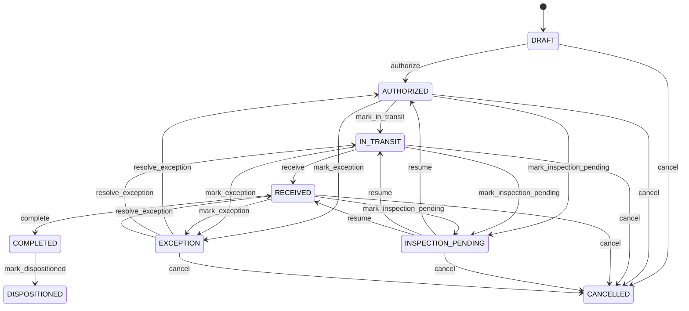

# Customer Return

Coordinates the controlled reversal of a customer fulfillment while preserving original commercial, inventory and financial history. A return is a new business event caused by a prior sale; it is not deletion or mutation of the original sale. A CreditNote is the separate financial consequence. Customer service, reverse logistics, warehouse receiving, quality, inventory, credit processing, accounts receivable and audit. SalesOrder/SalesOrderLine identify original demand, Shipment identifies prior logistics, Invoice identifies financial claims, CustomerReturnLine identifies returned quantities, disposition determines inventory consequences, and CreditNote records approved financial adjustment. Return request → authorization → return shipment → receipt → inspection → disposition → inventory movement if applicable → credit eligibility → CreditNote approval/posting if applicable → completion. Original sale and invoice remain unchanged. Draft → authorized → in transit → received → inspection → dispositioned → completed, with cancellation and exception paths. Authorization validates prior fulfillment; receipt creates no unrestricted inventory by itself; disposition drives inventory; approved financial adjustment creates CreditNote and accounting/application effects without mutating original documents. A customer returns 5 of 20 shipped units. Three are restocked, one quarantined and one scrapped. Inventory receives only the three restock units; an approved CreditNote handles the financial adjustment for the eligible credited amount.

## Finding records

Open **Customer Return** from the menu or from its card on the dashboard.

The list shows Return Number, Status, Return Date, Reason Code, Notes, Customer, Sales Order, with the most recently changed record first. The **Help** button beside the title opens this window's help text.

- **Search**: type in the search box above the grid to narrow the rows. **Search** at the top left opens advanced search, where you pick a field, a comparison (equals, contains, starts with, before, after, and so on) and a value.
- **Sort**: click a column heading; click again to reverse.
- **Refresh**: the refresh button at the top right re-reads the rows and every dropdown, so a record created a moment ago by someone else appears.
- **Export**: **CSV** downloads the rows you are looking at.
- **Open a record**: click a row. The line under the title, "Showing 1 to n of N entries", tells you how many rows match.

## Creating a record

Choose **New** at the top of the list. The form opens on its own page, with the fields in sections. A badge beside each label names the control (Text, Dropdown, Date, and so on); a red star marks a required field; the question-mark icon shows that field's help; and a hint such as “max 300” shows the longest entry accepted.

1. Fill in the fields described under [Fields](#fields).
2. These are required and must be completed before the record can be saved: **Return Number**, **Status**, **Return Date**, **Customer**.
3. For a dropdown that points at another window, pick the matching record; if the record you need does not exist yet, create it in its own window first. A dropdown may narrow to what you have already chosen, for example the states of the chosen country.
4. Choose **Create** (or **Save** in the toolbar). You return to the record, and it appears at the top of the list. If something is wrong the form says which field and why, and nothing is saved.

## Reading, changing and deleting a record

Click a row to open the record. Above the fields are the arrows that step through the list ("1 of 5"). Below them sit **Notes**, where anyone may leave a comment on the record, and the **Audit Trail**, which lists every change with who made it, when, and which fields changed.

- **Edit** (toolbar) makes the fields editable. Change them and choose **Save**; **Undo Changes** puts back what you changed and **Cancel Editing** leaves edit mode.
- **Copy Record** starts a new record from this one.
- **Delete Record** is available in edit mode and asks you to confirm; a record other records still depend on cannot be deleted.

Every change is also written to the [Audit Log](/administration/#audit-log).

## Fields

| Field | What you use | Rules | What to enter |
| --- | --- | --- | --- |
| Return Number | Text | Required, Unique, Up to 100 characters | Business-facing customer return reference. Identifies the return for customer service, warehouse and finance operations. Used in return authorization, transport, receiving, inspection, credit and audit. Distinct from customerReturnId, Shipment and CreditNote numbers. Provides operational reference throughout the return lifecycle. Required for operational traceability. |
| Status | Choice | Required | Lifecycle state of the authorized customer return. Controls progression through transport, receipt, inspection, disposition, inventory and financial adjustment. Controls return processing and completion decisions. Return status does not itself change inventory or invoice balances. Coordinates dependent return workflows; CreditNote posting is a separate financial state. The status of the customer return is draft; set it when that is what the business means for this record. The status of the customer return is authorized; set it when that is what the business means for this record. The status of the customer return is in transit; set it when that is what the business means for this record. The status of the customer return is received; set it when that is what the business means for this record. The status of the customer return is inspection pending; set it when that is what the business means for this record. The status of the customer return is dispositioned; set it when that is what the business means for this record. The status of the customer return is completed; set it when that is what the business means for this record. The status of the customer return is cancelled; set it when that is what the business means for this record. The status of the customer return is exception; set it when that is what the business means for this record. Choose one: Draft, Authorized, In transit, Received, Inspection pending, Dispositioned, Completed, Cancelled, Exception. |
| Return Date | Date and time | Required | Date and time the return event was initiated or recognized. Anchors return chronology independently from receipt and credit-note dates. Used for service metrics, logistics, audit and policy evaluation. Distinct from shipment, receipt, disposition and CreditNote dates. Provides temporal context for return authorization and processing. Required for return chronology. |
| Reason Code | Text | Up to 100 characters | Business reason supplied for the customer return. Explains why goods or services are being returned. Used for approval, quality, analytics, warranty and customer service. May differ from the financial CreditNote.reasonCode. Supports eligibility and policy determination. Optional when the reason is represented through another controlled return classification. |
| Notes | Text | Up to 2000 characters | Additional operational context for the return. Captures information not represented by structured return fields. Supports warehouse, customer service and audit review. Notes supplement but do not replace structured evidence. Provides contextual information during exception handling. Optional free-form context. |
| Customer | Lookup | Required | Customer requesting or receiving the return process. Identifies the party associated with the reverse transaction. Supports authorization, logistics, credit and customer service. Supplies party eligibility and financial context. Pick a record from **Customer**. |
| Sales Order | Lookup | Optional | Original sales commitment associated with the returned goods or services. Connects reverse fulfillment to the original customer demand. Supports eligibility and fulfillment reconciliation. Provides original commitment context for return validation. Pick a record from **Sales Order**. |

## How it connects to other records
- A customer return belongs to one **Customer**.
- A customer return belongs to one **Sales Order**.
- A customer return has many **Customer Return** records.

## Lifecycle: Customer return lifecycle

A customer return record starts as **Draft** and ends as **Dispositioned** or **Cancelled**. Open a record and the bar above its fields shows its current **State** and, after **Next**, a button for each move that leaves it; choose one to make the move. Any move the diagram does not draw is refused, for everyone including the administrator.

| From | To | Move |
| --- | --- | --- |
| Draft | Authorized | Authorize |
| Authorized | In transit | Mark in transit |
| In transit | Received | Receive |
| Received | Completed | Complete |
| Completed | Dispositioned | Mark dispositioned |
| Authorized | Inspection pending | Mark inspection pending |
| Inspection pending | Authorized | Resume |
| In transit | Inspection pending | Mark inspection pending |
| Inspection pending | In transit | Resume |
| Received | Inspection pending | Mark inspection pending |
| Inspection pending | Received | Resume |
| Authorized | Exception | Mark exception |
| Exception | Authorized | Resolve exception |
| In transit | Exception | Mark exception |
| Exception | In transit | Resolve exception |
| Received | Exception | Mark exception |
| Exception | Received | Resolve exception |
| Draft | Cancelled | Cancel |
| Authorized | Cancelled | Cancel |
| In transit | Cancelled | Cancel |
| Received | Cancelled | Cancel |
| Inspection pending | Cancelled | Cancel |
| Exception | Cancelled | Cancel |

## What happens when you save
Business rules run around the save. They are listed here and explained in full under [Business rules](/administration/rules/).

| Rule | When | Order |
| --- | --- | --- |
| Customer return workflows after update | after a customer return is changed | 100 |

Processes started from this record: [Customer return exception raised](/administration/processes/#customer-return-exception-raised), [Customer return follow up required](/administration/processes/#customer-return-follow-up-required), [Customer return completion confirmed](/administration/processes/#customer-return-completion-confirmed).

## Who may use it

Anyone who holds a role with access to the **Customer Return** window. Access is granted by role under [Roles and access](/administration/access/).
