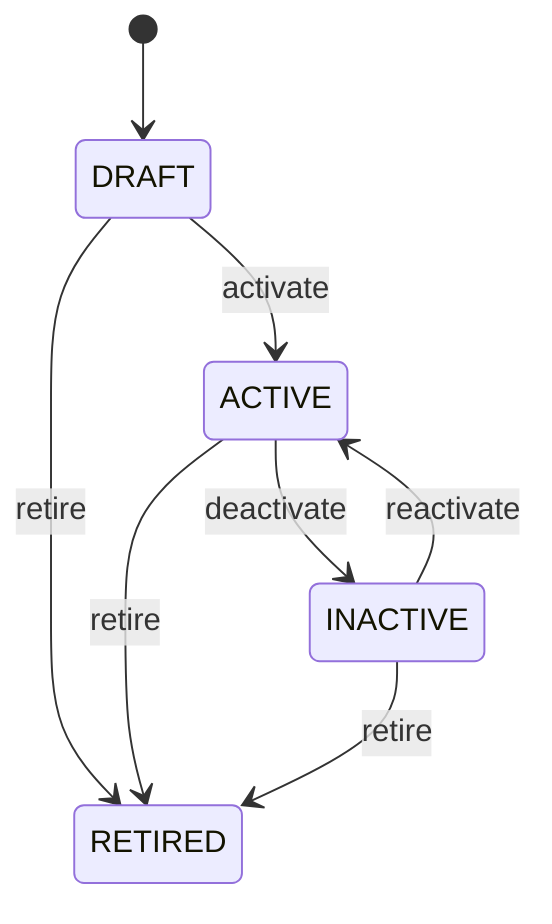

# Discount Rule

Defines reusable discount policy while leaving the actual applied discount as transaction evidence. A DiscountRule is a pricing policy; it is not the discount amount recorded on an order or invoice. Supports customer pricing, promotions, contracts, sales orders, purchase agreements, and invoicing. Product and pricing context determine the eligible base. DiscountRule determines the reduction. Tax rules then operate on the applicable taxable base according to jurisdiction and policy. Product/price → eligible discount rule → calculate discount → gross amount minus discount → taxable base → tax → net amount → invoice total. The applied transaction result must be retained independently of later rule changes. Rules are drafted, activated, deactivated, and retired. Lifecycle changes affect future calculations and do not rewrite historical transaction prices. A 10% discount rule applied to a USD 1,000 eligible base produces a USD 100 transaction discount and USD 900 post-discount base before subsequent tax calculation.

## Finding records

Open **Discount Rule** from the menu or from its card on the dashboard.

The list shows Code, Name, Method, Value, Currency, Priority, Status, with the most recently changed record first. The **Help** button beside the title opens this window's help text.

- **Search**: type in the search box above the grid to narrow the rows. **Search** at the top left opens advanced search, where you pick a field, a comparison (equals, contains, starts with, before, after, and so on) and a value.
- **Sort**: click a column heading; click again to reverse.
- **Refresh**: the refresh button at the top right re-reads the rows and every dropdown, so a record created a moment ago by someone else appears.
- **Export**: **CSV** downloads the rows you are looking at.
- **Open a record**: click a row. The line under the title, "Showing 1 to n of N entries", tells you how many rows match.

## Creating a record

Choose **New** at the top of the list. The form opens on its own page, with the fields in sections. A badge beside each label names the control (Text, Dropdown, Date, and so on); a red star marks a required field; the question-mark icon shows that field's help; and a hint such as “max 300” shows the longest entry accepted.

1. Fill in the fields described under [Fields](#fields).
2. These are required and must be completed before the record can be saved: **Code**, **Name**, **Method**, **Value**, **Status**.
3. For a dropdown that points at another window, pick the matching record; if the record you need does not exist yet, create it in its own window first. A dropdown may narrow to what you have already chosen, for example the states of the chosen country.
4. Choose **Create** (or **Save** in the toolbar). You return to the record, and it appears at the top of the list. If something is wrong the form says which field and why, and nothing is saved.

## Reading, changing and deleting a record

Click a row to open the record. Above the fields are the arrows that step through the list ("1 of 5"). Below them sit **Notes**, where anyone may leave a comment on the record, and the **Audit Trail**, which lists every change with who made it, when, and which fields changed.

- **Edit** (toolbar) makes the fields editable. Change them and choose **Save**; **Undo Changes** puts back what you changed and **Cancel Editing** leaves edit mode.
- **Copy Record** starts a new record from this one.
- **Delete Record** is available in edit mode and asks you to confirm; a record other records still depend on cannot be deleted.

Every change is also written to the [Audit Log](/administration/#audit-log).

## Fields

| Field | What you use | Rules | What to enter |
| --- | --- | --- | --- |
| Code | Text | Required, Unique, Up to 100 characters | Business identifier for the discount rule. Used in configuration, pricing, order entry, promotions, contracts, and integrations. Identifies the reusable rule, not its eventual transaction result. Allows a qualifying transaction to resolve the intended discount policy. |
| Name | Text | Required, Up to 200 characters | Human-readable name of the discount rule. Used by business users when configuring or reviewing pricing. Describes the policy represented by the rule. Makes discount selection understandable during price determination. |
| Method | Choice | Required | Defines how the discount is calculated. Determines whether the rule reduces an amount by a percentage or fixed monetary value. FIXED_AMOUNT requires a currency context; PERCENTAGE is applied to an eligible monetary base. Supplies the calculation method used before tax determination and final transaction totals. The method of the discount rule is percentage; set it when that is what the business means for this record. The method of the discount rule is fixed amount; set it when that is what the business means for this record. Choose one: Percentage, Fixed amount. |
| Value | Amount | Required | Numeric discount value interpreted according to method. Used to calculate a transaction discount. For PERCENTAGE this is a percentage; for FIXED_AMOUNT this is a monetary value whose currency must be explicitly defined. Produces the transaction-level discount amount from the eligible base. |
| Currency | Lookup | Optional | Currency applicable when the discount method is FIXED_AMOUNT. Defines the denomination of a fixed discount. Not required for percentage discounts. Enables fixed discounts to be compared with the transaction's monetary base under valid currency rules. Pick a record from **Currency**. |
| Priority | Whole number | Optional | Ordering value used when multiple discount rules qualify. Supports deterministic discount selection or stacking policy. Priority does not itself authorize stacking; the applicable pricing policy must define whether rules can combine. Helps resolve competing discount rules consistently. |
| Status | Choice | Required | Controls whether the rule can be selected for new price calculations. Used by pricing and transaction validation. Retiring a rule must not change discounts already recorded on historical transactions. Controls future applicability while preserving historical pricing evidence. The status of the discount rule is draft; set it when that is what the business means for this record. The status of the discount rule is active; set it when that is what the business means for this record. The status of the discount rule is inactive; set it when that is what the business means for this record. The status of the discount rule is retired; set it when that is what the business means for this record. Choose one: Draft, Active, Inactive, Retired. |

## How it connects to other records
- A discount rule belongs to one **Currency**.

## Lifecycle: Discount rule lifecycle

A discount rule record starts as **Draft** and ends as **Retired**. Open a record and the bar above its fields shows its current **State** and, after **Next**, a button for each move that leaves it; choose one to make the move. Any move the diagram does not draw is refused, for everyone including the administrator.

| From | To | Move |
| --- | --- | --- |
| Draft | Active | Activate |
| Active | Inactive | Deactivate |
| Inactive | Active | Reactivate |
| Draft | Retired | Retire |
| Active | Retired | Retire |
| Inactive | Retired | Retire |

## Who may use it

Anyone who holds a role with access to the **Discount Rule** window. Access is granted by role under [Roles and access](/administration/access/).
