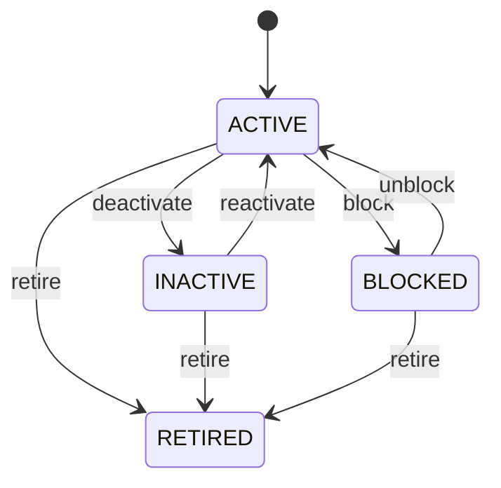

# Customer

Represents the commercial customer role of a Party. Party identifies who the party is; PartyRole establishes a role; Customer governs buyer-specific commercial behavior and controls. Central to sales order-to-cash, pricing, billing, receivables, collections, service, and customer analytics. Customer connects to SalesOrder, Invoice, Payment, PaymentAllocation through those transaction entities while retaining the underlying Party identity. Customer onboarding → eligibility/credit → SalesOrder → fulfillment → Invoice → Payment → PaymentAllocation → receivables settlement. Customer status constrains new activity but does not replace transaction evidence or rewrite history. Onboard → active → inactive/blocked → retired. Future eligibility changes do not invalidate historical relationships. A Party may simultaneously act as Customer and Supplier. Both roles reference the same Party identity while maintaining separate commercial controls and histories.

## Finding records

Open **Customer** from the menu or from its card on the dashboard.

The list shows Party Role, Customer Code, Customer Type, Credit Status, Credit Limit, Payment Terms, Status, with the most recently changed record first. The **Help** button beside the title opens this window's help text.

- **Search**: type in the search box above the grid to narrow the rows. **Search** at the top left opens advanced search, where you pick a field, a comparison (equals, contains, starts with, before, after, and so on) and a value.
- **Sort**: click a column heading; click again to reverse.
- **Refresh**: the refresh button at the top right re-reads the rows and every dropdown, so a record created a moment ago by someone else appears.
- **Export**: **CSV** downloads the rows you are looking at.
- **Open a record**: click a row. The line under the title, "Showing 1 to n of N entries", tells you how many rows match.

## Creating a record

Choose **New** at the top of the list. The form opens on its own page, with the fields in sections. A badge beside each label names the control (Text, Dropdown, Date, and so on); a red star marks a required field; the question-mark icon shows that field's help; and a hint such as “max 300” shows the longest entry accepted.

1. Fill in the fields described under [Fields](#fields).
2. These are required and must be completed before the record can be saved: **Party Role**, **Customer Code**, **Status**, **Party**, **Role Type**.
3. For a dropdown that points at another window, pick the matching record; if the record you need does not exist yet, create it in its own window first. A dropdown may narrow to what you have already chosen, for example the states of the chosen country.
4. Choose **Create** (or **Save** in the toolbar). You return to the record, and it appears at the top of the list. If something is wrong the form says which field and why, and nothing is saved.

## Reading, changing and deleting a record

Click a row to open the record. Above the fields are the arrows that step through the list ("1 of 5"). Below them sit **Notes**, where anyone may leave a comment on the record, and the **Audit Trail**, which lists every change with who made it, when, and which fields changed.

- **Edit** (toolbar) makes the fields editable. Change them and choose **Save**; **Undo Changes** puts back what you changed and **Cancel Editing** leaves edit mode.
- **Copy Record** starts a new record from this one.
- **Delete Record** is available in edit mode and asks you to confirm; a record other records still depend on cannot be deleted.

Every change is also written to the [Audit Log](/administration/#audit-log).

## Fields

| Field | What you use | Rules | What to enter |
| --- | --- | --- | --- |
| Party Role | Lookup | Required, Unique | Links Customer to its underlying PartyRole. Resolves common party identity and role information. Customer is a role specialization and must not duplicate Party identity. Supplies common party context to customer-facing workflows. Required because Customer depends on PartyRole. Pick a record from **Party Role**. |
| Customer Code | Text | Required, Unique, Up to 100 characters | Human-facing customer business code. Used in orders invoices statements integrations and communication. Distinct from customerId and external legal identifiers. Supports customer selection and transaction recognition. Required for operational identification. |
| Customer Type | Choice | Optional | Commercial classification of the customer relationship. Supports pricing credit tax service and reporting. Does not replace Party partyType. Supplies customer classification to transaction policy. Optional when not needed. The customer type of the customer is individual; set it when that is what the business means for this record. The customer type of the customer is business; set it when that is what the business means for this record. The customer type of the customer is government; set it when that is what the business means for this record. The customer type of the customer is internal; set it when that is what the business means for this record. The customer type of the customer is other; set it when that is what the business means for this record. Choose one: Individual, Business, Government, Internal, Other. |
| Credit Status | Choice | Optional | Current credit-control disposition. Used by order authorization receivables collections and credit review. Credit control affects exposure and does not alter party identity. SalesOrder confirmation must evaluate current credit policy when applicable. Optional where credit controls are not used. The credit status of the customer is not reviewed; set it when that is what the business means for this record. The credit status of the customer is approved; set it when that is what the business means for this record. The credit status of the customer is on hold; set it when that is what the business means for this record. The credit status of the customer is blocked; set it when that is what the business means for this record. Choose one: Not reviewed, Approved, On hold, Blocked. |
| Credit Limit | Amount | Optional | Authorized monetary credit exposure limit. Used in credit checks exposure monitoring and risk reporting. Must be interpreted with currency outstanding exposure payment terms and credit status. Provides one input to credit authorization before additional exposure. Optional for cash-only customers. |
| Payment Terms | Lookup | Optional | Default settlement policy for customer invoices. Used by SalesOrder Invoice receivables collections and cash forecasting. May be overridden by authorized contract or transaction-level terms. Supplies default due-date expectations to order and invoice creation. Optional when determined elsewhere. Pick a record from **Payment Term**. |
| Status | Choice | Required | Lifecycle state of the customer relationship. Controls eligibility for new commercial activity. Historical transactions remain attributable after status changes. New workflows must evaluate status; historical records remain valid. Required for eligibility decisions. The status of the customer is active; set it when that is what the business means for this record. The status of the customer is inactive; set it when that is what the business means for this record. The status of the customer is blocked; set it when that is what the business means for this record. The status of the customer is retired; set it when that is what the business means for this record. Choose one: Active, Inactive, Blocked, Retired. |
| Party | Lookup | Required | Identifies the underlying person or organization performing this role. Provides common identity without duplicating Party data. One Party may have multiple PartyRoles simultaneously or historically. Connects role-specific processing back to the canonical identity. Required because a role cannot exist without a participant. Pick a record from **Party**. |
| Role Type | Choice | Required | Defines the business capacity in which the Party participates. Determines specialized capabilities, policies, workflows, and validations. Separate from Party.partyType, which describes whether the participant is a person or organization. Selects the applicable downstream role specialization and business process. Required for contextual participation. The role type of the party role is customer; set it when that is what the business means for this record. The role type of the party role is supplier; set it when that is what the business means for this record. The role type of the party role is employee; set it when that is what the business means for this record. The role type of the party role is partner; set it when that is what the business means for this record. The role type of the party role is carrier; set it when that is what the business means for this record. The role type of the party role is agent; set it when that is what the business means for this record. The role type of the party role is contractor; set it when that is what the business means for this record. The role type of the party role is owner; set it when that is what the business means for this record. The role type of the party role is investor; set it when that is what the business means for this record. The role type of the party role is other; set it when that is what the business means for this record. Choose one: Customer, Supplier, Employee, Partner, Carrier, Agent, Contractor, Owner, Investor, Other. |
| Code | Text | Up to 100 characters | Optional business-context identifier for this role instance. Supports operational search, integrations, reports, and legacy references. Identifies the role instance and must not replace Party or specialized role identifiers. Optional when partyRoleId is sufficient. |
| Valid From | Date | Optional | Date from which this role is eligible for ordinary business processing. Used by eligibility and transaction validation. Works with validTo and status; ending a role does not delete Party identity or other roles. Prevents premature use of a newly established role. Optional for immediately effective roles. |
| Valid To | Date | Optional | Date after which the role is no longer normally eligible for new business processing. Used by eligibility, renewal, reporting, and expiry workflows. Historical transactions may continue referencing the role after validTo. Prevents new use after role expiration while preserving historical attribution. Optional for open-ended roles. |
| Organization | Lookup | Optional | Optional organizational scope in which the role is recognized. Supports multi-enterprise, subsidiary, business-unit, and operating-context scenarios. Zero means global/context-independent; one means explicitly scoped to one organization. Determines which organization can use the role for applicable transactions and policies. Pick a record from **Organization**. |

## How it connects to other records
- A customer has one **Party Role**.
- A customer has many **Address** records.
- A customer has many **Sales Order** records.
- A customer belongs to one **Party**.
- A customer belongs to one **Organization**.
- A customer has many **Lead** records.
- A customer has many **Opportunity** records.
- A customer has many **Quotation** records.
- A customer belongs to one **Payment Term**.
- A customer has many **Customer Return** records.

## Lifecycle: Customer lifecycle

A customer record starts as **Active** and ends as **Retired**. Open a record and the bar above its fields shows its current **State** and, after **Next**, a button for each move that leaves it; choose one to make the move. Any move the diagram does not draw is refused, for everyone including the administrator.

| From | To | Move |
| --- | --- | --- |
| Active | Inactive | Deactivate |
| Inactive | Active | Reactivate |
| Active | Blocked | Block |
| Blocked | Active | Unblock |
| Active | Retired | Retire |
| Inactive | Retired | Retire |
| Blocked | Retired | Retire |

## What happens when you save
Business rules run around the save. They are listed here and explained in full under [Business rules](/administration/rules/).

| Rule | When | Order |
| --- | --- | --- |
| Customer workflows after update | after a customer is changed | 100 |

Processes started from this record: [Customer exception raised](/administration/processes/#customer-exception-raised).

## Who may use it

Anyone who holds a role with access to the **Customer** window. Access is granted by role under [Roles and access](/administration/access/).
