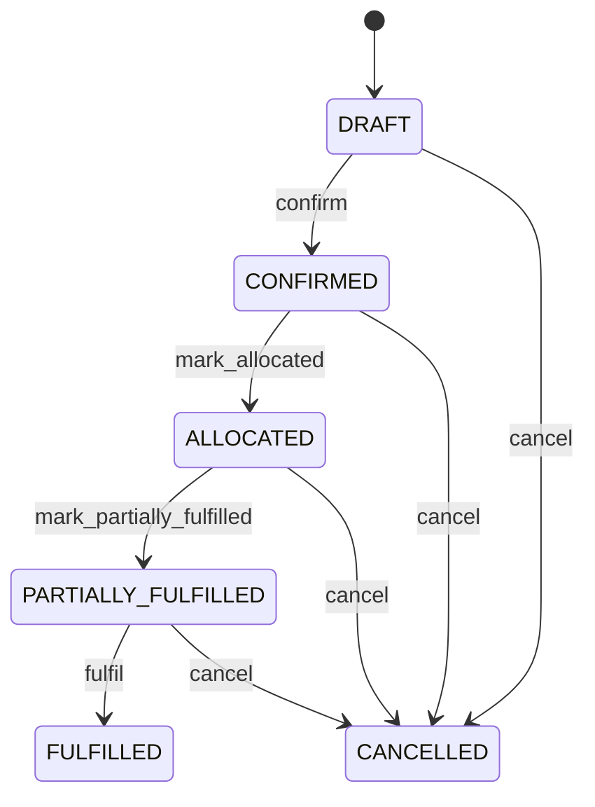

# Sales Order

Represents the commercial customer commitment from which fulfillment and financial processes derive work. SalesOrder establishes accepted demand; it does not itself move inventory, prove shipment, or prove payment. Order management, allocation, inventory, warehouse execution, transportation, invoicing, customer service and revenue processes. Customer supplies commercial context, SalesOrderLine supplies demand detail, InventoryReservation supplies committed stock, InventoryMovement supplies stock execution, Shipment supplies transport evidence, and Invoice supplies financial claim evidence. Confirmed order → validation → availability check → reservation/allocation → pick/issue → Shipment → delivery/acceptance evidence → SalesOrderLine fulfillment → order status. Invoice is generated according to billing policy and remains independent evidence. Cancellation releases remaining reservations and stops new work while preserving historical downstream effects. Draft → confirmed → allocated → partially fulfilled → fulfilled, with cancellation of remaining demand and controlled exception/recovery paths. Entity changes must propagate through affected dependent workflows rather than directly mutating derived states. Line fulfillment changes recalculate order status; reservation changes affect allocation state; shipment events contribute fulfillment evidence; billing changes do not independently determine fulfillment. Allocation, fulfillment, cancellation and status transitions require concurrency control and idempotency to prevent double reservation, double fulfillment or contradictory terminal states. An order for 20 units reserves 20, ships 12, and becomes PARTIALLY_FULFILLED from accepted fulfillment evidence. The remaining 8 stay executable. A cancellation then releases the remaining reservation and terminates the open demand without reversing the already accepted 12-unit fulfillment.

## Finding records

Open **Sales Order** from the menu or from its card on the dashboard.

The list shows Order Number, Order Date, Status, Currency, Requested Delivery Date, Total Amount, Customer, with the most recently changed record first. The **Help** button beside the title opens this window's help text.

- **Search**: type in the search box above the grid to narrow the rows. **Search** at the top left opens advanced search, where you pick a field, a comparison (equals, contains, starts with, before, after, and so on) and a value.
- **Sort**: click a column heading; click again to reverse.
- **Refresh**: the refresh button at the top right re-reads the rows and every dropdown, so a record created a moment ago by someone else appears.
- **Export**: **CSV** downloads the rows you are looking at.
- **Open a record**: click a row. The line under the title, "Showing 1 to n of N entries", tells you how many rows match.

## Creating a record

Choose **New** at the top of the list. The form opens on its own page, with the fields in sections. A badge beside each label names the control (Text, Dropdown, Date, and so on); a red star marks a required field; the question-mark icon shows that field's help; and a hint such as “max 300” shows the longest entry accepted.

1. Fill in the fields described under [Fields](#fields).
2. These are required and must be completed before the record can be saved: **Order Number**, **Order Date**, **Status**, **Customer**.
3. For a dropdown that points at another window, pick the matching record; if the record you need does not exist yet, create it in its own window first. A dropdown may narrow to what you have already chosen, for example the states of the chosen country.
4. Choose **Create** (or **Save** in the toolbar). You return to the record, and it appears at the top of the list. If something is wrong the form says which field and why, and nothing is saved.

## Reading, changing and deleting a record

Click a row to open the record. Above the fields are the arrows that step through the list ("1 of 5"). Below them sit **Notes**, where anyone may leave a comment on the record, and the **Audit Trail**, which lists every change with who made it, when, and which fields changed.

- **Edit** (toolbar) makes the fields editable. Change them and choose **Save**; **Undo Changes** puts back what you changed and **Cancel Editing** leaves edit mode.
- **Copy Record** starts a new record from this one.
- **Delete Record** is available in edit mode and asks you to confirm; a record other records still depend on cannot be deleted.

Every change is also written to the [Audit Log](/administration/#audit-log).

## Fields

| Field | What you use | Rules | What to enter |
| --- | --- | --- | --- |
| Order Number | Text | Required, Unique, Up to 100 characters | The order number of the sales order: a value the business records on it. Entered or maintained when a sales order is created or changed; shown on its form and available to search and reports. Read together with the sales order's other fields and its relationships; it is not meaningful on its own. Required: a sales order cannot be understood without its order number. |
| Order Date | Date and time | Required | The order date of the sales order: a point in time the business records on it. Entered or maintained when a sales order is created or changed; shown on its form and available to search and reports. Read together with the sales order's other fields and its relationships; it is not meaningful on its own. Required: a sales order cannot be understood without its order date. |
| Status | Choice | Required | Order-level lifecycle state controlling commercial and fulfillment permissions. Drives confirmation, allocation, fulfillment, shipment readiness and cancellation. Summarizes downstream evidence; it is not an independent source of fulfillment quantity. Status transitions are validated against line, reservation, shipment and fulfillment evidence. The status of the sales order is draft; set it when that is what the business means for this record. The status of the sales order is confirmed; set it when that is what the business means for this record. The status of the sales order is allocated; set it when that is what the business means for this record. The status of the sales order is partially fulfilled; set it when that is what the business means for this record. The status of the sales order is fulfilled; set it when that is what the business means for this record. The status of the sales order is cancelled; set it when that is what the business means for this record. Choose one: Draft, Confirmed, Allocated, Partially fulfilled, Fulfilled, Cancelled. |
| Currency | Lookup | Optional | The currency id of the sales order: a link to another record the business records on it. Entered or maintained when a sales order is created or changed; shown on its form and available to search and reports. Read together with the sales order's other fields and its relationships; it is not meaningful on its own. Pick a record from **Currency**. |
| Requested Delivery Date | Date | Optional | The requested delivery date of the sales order: a calendar date the business records on it. Entered or maintained when a sales order is created or changed; shown on its form and available to search and reports. Read together with the sales order's other fields and its relationships; it is not meaningful on its own. |
| Total Amount | Amount | Optional | The total amount of the sales order: a number the business records on it. Entered or maintained when a sales order is created or changed; shown on its form and available to search and reports. Read together with the sales order's other fields and its relationships; it is not meaningful on its own. |
| Customer | Lookup | Required | Links a sales order to customer, the customer it relates to. Chosen from the existing customer records when the sales order is created or edited. A sales order has exactly one customer in this role. Lets the sales order be found from, and reported with, its customer. Pick a record from **Customer**. |
| Organization | Lookup | Optional | Links a sales order to organization, the organization it relates to. Chosen from the existing organization records when the sales order is created or edited. A sales order has at most one organization in this role. Lets the sales order be found from, and reported with, its organization. Pick a record from **Organization**. |
| Delivery Location | Lookup | Optional | Links a sales order to location, the delivery location it relates to. Chosen from the existing location records when the sales order is created or edited. A sales order has at most one location in this role. Lets the sales order be found from, and reported with, its location. Pick a record from **Location**. |
| Payment Term | Lookup | Optional | The PaymentTerm this SalesOrder belongs to. Pick a record from **Payment Term**. |

## How it connects to other records
- A sales order belongs to one **Currency**.
- A sales order belongs to one **Customer**.
- A sales order has many **Opportunity** records.
- A sales order belongs to one **Organization**.
- A sales order has many **Sales Order** records.
- A sales order belongs to one **Location**.
- A sales order belongs to one **Payment Term**.
- A sales order has many **Customer Return** records.

## Lifecycle: Sales order lifecycle

A sales order record starts as **Draft** and ends as **Fulfilled** or **Cancelled**. Open a record and the bar above its fields shows its current **State** and, after **Next**, a button for each move that leaves it; choose one to make the move. Any move the diagram does not draw is refused, for everyone including the administrator.

| From | To | Move |
| --- | --- | --- |
| Draft | Confirmed | Confirm |
| Confirmed | Allocated | Mark allocated |
| Allocated | Partially fulfilled | Mark partially fulfilled |
| Partially fulfilled | Fulfilled | Fulfil |
| Draft | Cancelled | Cancel |
| Confirmed | Cancelled | Cancel |
| Allocated | Cancelled | Cancel |
| Partially fulfilled | Cancelled | Cancel |

## What happens when you save
Business rules run around the save. They are listed here and explained in full under [Business rules](/administration/rules/).

| Rule | When | Order |
| --- | --- | --- |
| Sales order invariants before create | before a sales order is created | 100 |
| Sales order invariants before update | before a sales order is changed | 100 |
| Sales order workflows after update | after a sales order is changed | 100 |

Processes started from this record: [Sales order follow up required](/administration/processes/#sales-order-follow-up-required), [Sales order completion confirmed](/administration/processes/#sales-order-completion-confirmed).

## Who may use it

Anyone who holds a role with access to the **Sales Order** window. Access is granted by role under [Roles and access](/administration/access/).
